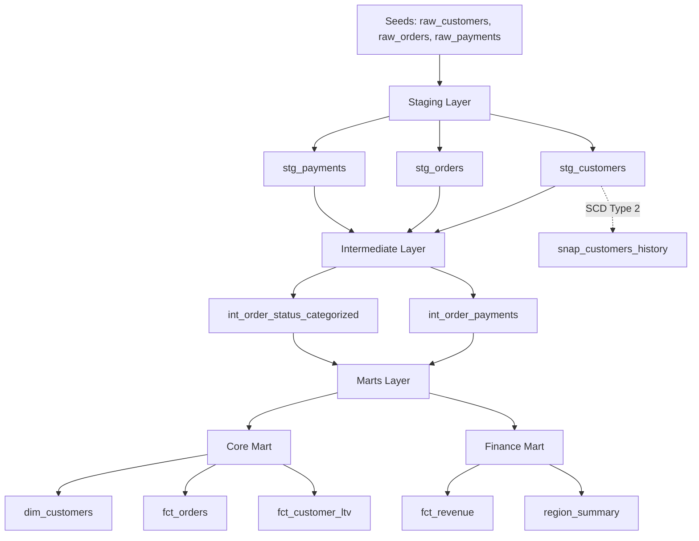

# dbt Production Blueprint

[](https://docs.getdbt.com/)
[](https://python.org/)
[](LICENSE)
[](https://remisharoon.github.io/dbt-production-blueprint/)
[](https://github.com/remisharoon/dbt-production-blueprint)

A production-grade dbt project that demonstrates real-world enterprise patterns for an e-commerce (retail) warehouse. This repository is intentionally "kitchen sink" and includes staging cleanup, intermediate logic, marts, incremental models, snapshots, macros, custom tests, exposures, selectors, operational hooks, and a full documentation site.

**Quick Start with DuckDB (Demo/Testing)**
```bash
# Install dependencies
pip install -r requirements.txt

# Install dbt packages
dbt deps

# Load seed data
dbt seed

# Build everything
dbt build
```

## 🏗️ Architecture



## 📊 Project Stats

| Metric | Count |
|--------|-------|
| **Models** | 10 |
| **Tests** | 50+ |
| **Data Layers** | 3 |
| **Regions** | 4 |
| **Snapshots** | 1 |
| **Custom Macros** | 7 |

## 🎯 Key Features

- **DuckDB support** for local development, testing, and documentation (no external database required)
- Snowflake-optimized SQL with dbt 1.8+ (production-ready)
- Layered model design: `staging` -> `intermediate` -> `marts`.
- Incremental fact processing with soft-delete handling.
- SCD Type 2 snapshots for customer history.
- Dynamic SQL generation via macros.
- Custom generic tests and data tests.
- Enforced model contracts with column data types.
- Doc blocks and model descriptions.
- Run hooks and access grants.
- State-based CI selectors for `state:modified` workflows.
- MkDocs site with embedded dbt docs and interactive data lineage.

## 📚 Documentation

- **[Live Documentation Site](https://remisharoon.github.io/dbt-production-blueprint/)** - Full interactive documentation
- **[Data Dictionary](https://remisharoon.github.io/dbt-production-blueprint/reference/data-dictionary/)** - All fields and columns documented
- **[Data Lineage](https://remisharoon.github.io/dbt-production-blueprint/architecture/data-flow/)** - Visual data flow diagrams
- **[Macro Reference](https://remisharoon.github.io/dbt-production-blueprint/reference/macros/)** - Macro API documentation
- **[Architecture Decisions](https://remisharoon.github.io/dbt-production-blueprint/architecture/decisions/)** - ADRs documenting design choices

## 📂 Project Structure

```
models/
  staging/          # 3 models: Raw source normalization
  intermediate/     # 2 models: Business logic layer
  marts/            # 5 models: Analytics-ready tables
    core/           # 3 models: Dimensions & facts
    finance/        # 2 models: Revenue aggregates
seeds/              # 3 seed files: Sample data
macros/             # 7 macros: Reusable SQL & tests
tests/              # 1 data test: Revenue consistency
analyses/           # Ad-hoc analysis directory
snapshots/          # 1 snapshot: SCD Type 2 history
docs/               # MkDocs documentation site
```

## 🚀 Quick Start (DuckDB - Recommended for Demo/Testing)

```bash
# Step 1: Install Python dependencies (includes dbt-duckdb adapter)
pip install -r requirements.txt

# Step 2: Install dbt packages (dbt_utils, dbt_expectations, audit_helper)
dbt deps

# Step 3: Load seed data
dbt seed

# Step 4: Build everything (models + tests + snapshots)
dbt build

# Step 5: Generate and serve documentation
dbt docs generate
dbt docs serve
```

**Important**: You must install Python dependencies (Step 1) before running `dbt deps` (Step 2). The DuckDB adapter is a Python package installed via pip, not a dbt package.

**Automated Setup**: Run `./quickstart.sh` for automated installation.

## 📖 Additional Guides

- [`INSTALL.md`](INSTALL.md) - Step-by-step installation guide
- [`SETUP_GUIDE.md`](SETUP_GUIDE.md) - Detailed setup and configuration
- [`TROUBLESHOOTING.md`](TROUBLESHOOTING.md) - Common issues and solutions
- [`DUCKDB_SETUP.md`](DUCKDB_SETUP.md) - DuckDB-specific information
- [`GITHUB_ACTIONS.md`](GITHUB_ACTIONS.md) - GitHub Actions CI/CD guide
- [`QUICK_REFERENCE.md`](QUICK_REFERENCE.md) - Quick reference for commands

## 🏭 Quick Start (Snowflake - Production)

```bash
# Install Python dependencies
pip install -r requirements.txt

# Install dbt packages
dbt deps

# Configure your Snowflake profile in ~/.dbt/profiles.yml
# See SETUP_GUIDE.md for detailed instructions

# Load seed data
dbt seed

# Build everything
dbt build
```

## 🔧 Common Workflows

```bash
# Run only staging
dbt run --select staging_only

# Run marts only
dbt run --select marts_only

# Build modified nodes using a prior state
dbt build --select state_modified_plus --state path/to/previous/manifest

# Build just modified models (no downstream)
dbt build --select state_modified --state path/to/previous/manifest
```

## 🎯 Selectors

Selectors live in `selectors.yml` and include:
- `state_modified`, `state_modified_plus`, `state_modified_configs`
- `staging_only`, `marts_only`

## 🌱 Seeds

Seed data is intentionally dirty to showcase cleaning logic and data quality testing.
- `seeds/raw_customers.csv` (11 rows) - Duplicates, missing names, mixed case emails
- `seeds/raw_orders.csv` (12 rows) - Duplicates, missing order_total, mixed status
- `seeds/raw_payments.csv` (12 rows) - Duplicates, missing amounts, mixed methods

## 🔄 Staging Models

| Model | Description |
|-------|-------------|
| `stg_customers` | Customer standardization with surrogate keys and region normalization |
| `stg_orders` | Order header standardization with soft-delete handling |
| `stg_payments` | Payment transaction normalization |

## ⚙️ Intermediate Models

| Model | Description |
|-------|-------------|
| `int_order_payments` | Order-payment aggregation with rollups and payment coverage |
| `int_order_status_categorized` | Dynamic status grouping using Jinja macro logic |

## 📊 Marts

### Core Mart (`mart_core` schema)

| Model | Type | Key Features |
|-------|------|--------------|
| `dim_customers` | Dimension | Deduplicated to latest record, post-hook grant to reporter role |
| `fct_orders` | Fact (Incremental) | Merge strategy with `order_id` unique key, soft-delete handling |
| `fct_customer_ltv` | Fact | Customer lifetime value aggregates with cohort analysis support |

### Finance Mart (`mart_finance` schema)

| Model | Description |
|-------|-------------|
| `fct_revenue` | Daily revenue by currency and region with `{{ doc('total_revenue') }}` metric |
| `region_summary` | Dynamic region rollup using macro-based SQL generation |

## 📸 Snapshots

- `snap_customers_history` - SCD Type 2 using `updated_at` strategy, tracks all customer attribute changes

## 🔧 Macros

| Macro | Purpose |
|-------|---------|
| `log_run_start()` | On-run-start hook that inserts run metadata into `audit_run` |
| `order_status_case()` | Generates dynamic CASE statement for status categorization |
| `generate_region_summary_sql()` | Builds dynamic SQL per region for rollup aggregations |
| `numeric_type(precision, scale)` | Adapter-dispatched numeric type (Snowflake vs others) |

## 🧪 Testing

- **Generic tests**: `not_null`, `unique`, and `relationships` applied across layers
- **dbt_expectations**: Advanced tests validating numeric ranges
- **Custom generic tests**:
  - `is_alphanumeric` - Validates ID columns are alphanumeric (macro: `macros/tests/is_alphanumeric.sql`)
  - `column_type_is` - Validates column data types match expected types (macro: `macros/tests/column_type_is.sql`)
- **Data tests**:
  - `revenue_consistency` - Cross-mart reconciliation test validating revenue matches across models

**Note**: Some tests use `severity: warn` to demonstrate real-world data quality issues without failing every run.

## 📝 Documentation

- Model and column-level docs live in `schema.yml` files in each model directory.
- Doc blocks are defined in `models/docs.md` for `Total Revenue` and `LTV` metrics.
- MkDocs site configuration is in `mkdocs.yml` and embeds dbt docs from `docs/dbt_artifacts`.
- The documentation website is published via GitHub Pages using the `gh-pages` branch.

## 🎯 Exposures

Defined in `models/exposures.yml` for downstream dependencies:
- `finance_executive_dashboard` - Finance dashboard consuming `fct_revenue`, `fct_orders`, `dim_customers`
- `customer_ltv_app` - Customer LTV application consuming `fct_customer_ltv`, `dim_customers`

## 🎣 Operational Hooks

- `on-run-start` - Inserts run metadata into `audit_run` table in the target schema
- `post-hook` on `dim_customers` - Grants read access to role `reporter`

## 🌐 Documentation Site (MkDocs + dbt Docs)

### Local Development

1. Install docs tooling.
```bash
pip install mkdocs mkdocs-material mkdocs-minify-plugin mkdocs-git-revision-date-localized-plugin
```

2. Generate dbt docs into MkDocs tree.
```bash
dbt docs generate --target-dir docs/dbt_artifacts
```

3. Serve locally.
```bash
mkdocs serve
```

If your local environment does not have a warehouse connection, you can run:
```bash
dbt docs generate --target-dir docs/dbt_artifacts --empty-catalog
```

## 🚀 GitHub Pages (Docs Deployment)

The documentation site is automatically deployed via GitHub Actions:
- GitHub Pages is configured to serve from the `gh-pages` branch
- Pushing to `main` branch triggers `.github/workflows/deploy-docs.yml`
- Workflow builds MkDocs site and deploys to `gh-pages` branch
- Site is available at: https://remisharoon.github.io/dbt-production-blueprint/
- No manual GitHub Pages configuration needed

## ⚙️ CI/CD with DuckDB

The GitHub Actions workflow uses DuckDB for documentation generation, which means:
- No external database connection required
- No need for `DBT_PROFILES_YML` secret
- Faster CI/CD pipeline
- Works out of the box without any configuration

The workflow automatically:
1. Installs `dbt-core` and `dbt-duckdb`
2. Installs dbt packages via `dbt deps`
3. Creates a DuckDB profile in CI
4. Generates dbt documentation
5. Deploys to GitHub Pages via MkDocs

## ➕ Where to Add Things

- New sources: `models/staging/_sources.yml`
- New staging models: `models/staging/`
- New business logic: `models/intermediate/`
- New marts: `models/marts/core` or `models/marts/finance`
- New macros: `macros/`
- New tests: `tests/` or `macros/tests/`
- New snapshots: `snapshots/`
- New documentation pages: `docs/`

## 🔐 Profiles Configuration

The project includes a [`profiles.yml`](profiles.yml) file pre-configured for DuckDB development. For production Snowflake usage, create a profile in `~/.dbt/profiles.yml`.

### DuckDB (Default - for Demo/Testing)

The project uses [`profiles.yml`](profiles.yml) in the project root with DuckDB configuration:
```yaml
dbt_production_blueprint_duckdb:
  target: dev
  outputs:
    dev:
      type: duckdb
      path: dev.duckdb
      schema: main
      threads: 4
```

### Snowflake (Production)

For production use, create `~/.dbt/profiles.yml`:
```yaml
dbt_production_blueprint_snowflake:
  target: dev
  outputs:
    dev:
      type: snowflake
      account: <account>
      user: <user>
      password: <password>
      role: <role>
      database: <database>
      warehouse: <warehouse>
      schema: <schema>
      threads: 4
```

See [`SETUP_GUIDE.md`](SETUP_GUIDE.md) for detailed setup instructions.

## 📋 Recommended CI Pattern

```bash
# Generate current state
dbt build

# Save manifest.json as CI baseline
# Next run:
dbt build --select state_modified_plus --state path/to/previous/manifest --defer
```

## 📄 License

See [`LICENSE`](LICENSE).

---

<div align="center">

**[View Live Documentation](https://remisharoon.github.io/dbt-production-blueprint/)**

Made with ❤️ for the dbt community

</div>
