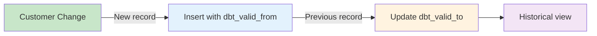

# Data Flow

Visual representation of how data flows through the dbt Production Blueprint.

## Complete Data Flow Diagram


## Detailed Flow by Layer

### 1. Seeds to Staging


**Transformations**:

| Source | Target | Transformations |
|--------|--------|-----------------|
| `raw_customers` | `stg_customers` | Surrogate keys, normalize regions, fix email casing, standardize status, clean names |
| `raw_orders` | `stg_orders` | Handle soft-deletes, fix status casing, cast numeric types, add timestamps |
| `raw_payments` | `stg_payments` | Normalize payment methods, cast amounts, track provider IDs |

### 2. Staging to Intermediate


**Business Logic**:

**`int_order_payments`**:
- Rolls up payments per order
- Calculates payment coverage (payments vs order_total)
- Identifies partial payments
- Tracks refunds and chargebacks

**`int_order_status_categorized`**:
- Groups order statuses into categories
- Completed: completed, shipped, delivered
- Open: placed, confirmed, processing
- Canceled: canceled, returned, refunded

### 3. Intermediate to Marts


**Marts Transformations**:

| Model | Input Models | Transformations |
|-------|--------------|-----------------|
| `dim_customers` | `stg_customers` | Deduplicate to latest, grant reporter access |
| `fct_orders` | `stg_orders`, `int_order_payments`, `int_order_status_categorized` | Incremental merge on order_id, partition by updated_at |
| `fct_customer_ltv` | `stg_customers`, `stg_orders`, `fct_orders` | Aggregate net revenue, order counts, cohort metrics |
| `fct_revenue` | `stg_customers`, `fct_orders`, `stg_payments` | Daily revenue by region and currency |
| `region_summary` | `fct_revenue` | Dynamic rollup using macro generation |

### 4. Staging to Snapshots


**Change Tracking**:
- Captures all customer attribute changes
- Uses `updated_at` timestamp for versioning
- Maintains `dbt_valid_from` and `dbt_valid_to` dates
- Invalidates hard deletes

## Data Quality Checkpoints


### Quality Gates

1. **Staging Layer**:
   - Not null checks on keys
   - Unique constraints (with warnings for known issues)
   - Accepted values for status fields
   - Alphanumeric validation for IDs

2. **Intermediate Layer**:
   - Relationship tests between models
   - Range checks for numeric values
   - Status categorization validation

3. **Marts Layer**:
   - Contract enforcement with data types
   - Foreign key relationships
   - Cross-mart reconciliation (revenue consistency)
   - Metric range validations

## Change Tracking Strategy

### Incremental Updates

**`fct_orders`** uses incremental processing:


**Strategy**:
- Unique key: `order_id`
- Strategy: `merge`
- Filter: `updated_at > (SELECT MAX(updated_at) FROM {{ this }})`

### Historical Tracking

**`snap_customers_history`** uses SCD Type 2:



**Output Columns**:
- `customer_id` - Natural key
- All customer attributes
- `dbt_valid_from` - Record valid start date
- `dbt_valid_to` - Record valid end date (null = current)
- `dbt_scd_id` - SCD record identifier

## Dependencies

### Model Dependency Graph


### Critical Path

The critical path for most analytics:

```
raw_orders → stg_orders → int_order_payments → fct_orders → fct_revenue
```

Any failure in this chain affects revenue reporting.

## Exposures

Downstream dependencies documented in `exposures.yml`:


| Exposure | Type | Depends On | Owner |
|----------|------|------------|-------|
| Finance Executive Dashboard | Dashboard | `fct_revenue`, `fct_orders`, `dim_customers` | Finance Analytics |
| Customer LTV App | Application | `fct_customer_ltv`, `dim_customers` | Customer Intelligence |

## Related Documentation

- [Layer Details](layers.md) - In-depth explanation of each layer
- [Design Patterns](patterns.md) - Architectural patterns used
- [Data Dictionary](../reference/data-dictionary.md) - Field-level documentation
