# Architecture Overview

The dbt Production Blueprint uses a **medallion architecture** pattern with clear separation of concerns across three distinct layers.

## Architecture Principles

1. **Separation of Concerns** - Each layer has a distinct and well-defined purpose
2. **Immutable Sources** - Raw data is never modified, only standardized
3. **Incremental Processing** - Efficient updates for large-scale data
4. **Data Quality First** - Comprehensive testing at every layer
5. **Self-Documenting** - Full column descriptions, contracts, and tests

## Layers at a Glance

### Layer Summary

| Layer | Schema | Materialization | Purpose | Models |
|-------|--------|-----------------|---------|--------|
| **Staging** | `stg` | View | Raw data standardization | 3 |
| **Intermediate** | `int` | View | Business logic & joins | 2 |
| **Marts** | `mart_core`, `mart_finance` | Table | Analytics-ready data | 5 |

## Data Flow

```mermaid
graph TD
    subgraph Seeds["📂 Seeds (Raw Data)"]
        SC[raw_customers.csv<br/>11 records]
        SO[raw_orders.csv<br/>12 records]
        SP[raw_payments.csv<br/>12 records]
    end
    
    subgraph Staging["🔵 Staging Layer"]
        SC --> STG1[stg_customers]
        SO --> STG2[stg_orders]
        SP --> STG3[stg_payments]
    end
    
    subgraph Intermediate["🟢 Intermediate Layer"]
        STG1 & STG2 & STG3 --> INT1[int_order_payments]
        STG2 --> INT2[int_order_status_categorized]
    end
    
    subgraph Marts_Core["🟠 Core Marts"]
        STG1 --> DIM[dim_customers]
        STG2 & INT1 & INT2 --> FCT1[fct_orders]
        STG1 & STG2 & FCT1 --> LTV[fct_customer_ltv]
    end
    
    subgraph Marts_Finance["🟣 Finance Marts"]
        STG1 & FCT1 & STG3 --> REV[fct_revenue]
        REV --> REG[region_summary]
    end
    
    subgraph Snapshots["📸 Snapshots"]
        STG1 -.->|SCD Type 2| SNAP[snap_customers_history]
    end
    
    style Seeds fill:#f9f9f9
    style Staging fill:#e3f2fd
    style Intermediate fill:#e8f5e9
    style Marts_Core fill:#fff3e0
    style Marts_Finance fill:#f3e5f5
    style Snapshots fill:#fce4ec
```

## Layer Responsibilities

### Staging Layer

**Purpose**: Standardize raw source data into a consistent format

**Key Activities**:
- Clean and normalize data
- Handle data type mismatches
- Apply consistent naming conventions
- Generate surrogate keys
- Handle null values and defaults

**Models**: `stg_customers`, `stg_orders`, `stg_payments`

**Schema**: `stg`

**Materialization**: View

### Intermediate Layer

**Purpose**: Apply business logic and create reusable transformations

**Key Activities**:
- Join across staging models
- Implement business rules
- Create reusable calculations
- Reduce duplication in marts

**Models**: `int_order_payments`, `int_order_status_categorized`

**Schema**: `int`

**Materialization**: View

### Marts Layer

**Purpose**: Deliver analytics-ready data for downstream consumption

**Key Activities**:
- Model business entities (dimensions and facts)
- Optimize for query performance
- Enforce contracts
- Include documentation for BI tools
- Apply access controls

**Models**:
- Core: `dim_customers`, `fct_orders`, `fct_customer_ltv`
- Finance: `fct_revenue`, `region_summary`

**Schemas**: `mart_core`, `mart_finance`

**Materialization**: Table

## Design Patterns

The architecture implements several key patterns:

-   :material-key:{ .lg .middle } __Surrogate Keys__

    ---

    Hash-based stable identifiers for entities

    [:octicons-arrow-right-24: Learn More](patterns.md#2-surrogate-keys)

-   :material-refresh:{ .lg .middle } __Incremental Processing__

    ---

    Efficient updates using merge strategies

    [:octicons-arrow-right-24: Learn More](patterns.md#3-incremental-processing)

-   :material-delete-off:{ .lg .middle } __Soft Deletes__

    ---

    Mark records as deleted without removal

    [:octicons-arrow-right-24: Learn More](patterns.md#4-soft-deletes)

-   :material-history:{ .lg .middle } __SCD Type 2__

    ---

    Track full history of dimension changes

    [:octicons-arrow-right-24: Learn More](patterns.md#5-scd-type-2-snapshots)

## Data Quality

Quality is enforced at every layer:

### Testing Strategy

| Layer | Test Types |
|-------|------------|
| Staging | Not null, unique, relationships, accepted values, custom tests |
| Intermediate | Not null, unique, accepted values, range checks |
| Marts | Contracts, not null, unique, relationships, cross-mart reconciliation |

## Naming Conventions

Consistent naming makes the project self-documenting:

| Prefix | Layer | Example |
|--------|-------|---------|
| `stg_` | Staging | `stg_customers` |
| `int_` | Intermediate | `int_order_payments` |
| `dim_` | Dimension | `dim_customers` |
| `fct_` | Fact | `fct_orders` |
| `snap_` | Snapshot | `snap_customers_history` |

## Explore Further

-   :material-sitemap:{ .lg .middle } __Data Flow__

    ---

    Visual diagrams of data movement

    [:octicons-arrow-right-24: View Diagrams](data-flow.md)

-   :material-layers:{ .lg .middle } __Layer Details__

    ---

    In-depth layer explanations

    [:octicons-arrow-right-24: Explore Layers](layers.md)

-   :material-puzzle:{ .lg .middle } __Patterns__

    ---

    Architectural design patterns

    [:octicons-arrow-right-24: View Patterns](patterns.md)

-   :material-file-document:{ .lg .middle } __Decisions__

    ---

    Architecture Decision Records

    [:octicons-arrow-right-24: Read ADRs](decisions/adr-001-duckdb-ci.md)

