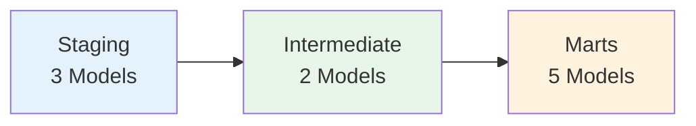

# Data Layers

Detailed explanation of each layer in the medallion architecture.

## Layer Overview



---

## Staging Layer (`stg_*`)

### Purpose

Standardize raw source data into a consistent format. This is the first transformation layer where we clean, normalize, and prepare data for downstream use.

### Key Principles

1. **One staging model per source table**
2. **Lightweight transformations only** - No business logic
3. **Consistent naming conventions** - Lowercase, snake_case
4. **Type casting** - Ensure correct data types
5. **Surrogate keys** - Generate stable identifiers

### Materialization

**Views** - No data duplication, always reflects latest source data.

```yaml
models:
  staging:
    +materialized: view
    +schema: stg
```

### Models

#### `stg_customers`

Standardizes customer data from `raw_customers` seed.

**Transformations**:
- Generates `customer_key` via `dbt_utils.generate_surrogate_key`
- Normalizes region names ("NA" → "North America")
- Fixes email casing (lowercase)
- Standardizes customer status ("active", "inactive")
- Cleans name fields (trim, title case)

**Key Columns**:

| Column | Type | Description |
|--------|------|-------------|
| customer_id | string | Natural key from source |
| customer_key | string | Surrogate key (hash) |
| name | string | Customer name (cleaned) |
| email | string | Email address (normalized) |
| region | string | Geographic region |
| status | string | Customer status |

**Tests**:
- `not_null`: customer_id, customer_key
- `unique`: customer_id (severity: warn - known duplicates in seed)
- `is_alphanumeric`: customer_id
- `accepted_values`: status [active, inactive]

#### `stg_orders`

Standardizes order transactions from `raw_orders` seed.

**Transformations**:
- Generates `order_key` via surrogate key
- Handles soft-delete flag (`is_deleted`)
- Normalizes order status casing
- Casts numeric types for `order_total`
- Adds `updated_at` timestamp for incremental processing

**Key Columns**:

| Column | Type | Description |
|--------|------|-------------|
| order_id | string | Natural key from source |
| order_key | string | Surrogate key (hash) |
| customer_id | string | Customer reference (FK) |
| order_date | date | Order placement date |
| order_total | decimal | Order amount |
| currency | string | Currency code (USD, EUR, etc.) |
| status | string | Order status |
| is_deleted | boolean | Soft-delete flag |
| updated_at | timestamp | Last update timestamp |

**Tests**:
- `not_null`: order_id, order_key
- `unique`: order_id (severity: warn)
- `relationships`: customer_id → stg_customers.customer_id
- `accepted_values`: status [completed, placed, shipped, returned, canceled]
- `is_alphanumeric`: order_id

#### `stg_payments`

Normalizes payment transactions from `raw_payments` seed.

**Transformations**:
- Generates `payment_key` via surrogate key
- Standardizes payment method names ("credit card" → "credit_card")
- Casts `amount` to numeric type
- Tracks provider transaction IDs

**Key Columns**:

| Column | Type | Description |
|--------|------|-------------|
| payment_id | string | Natural key from source |
| payment_key | string | Surrogate key (hash) |
| order_id | string | Order reference (FK) |
| payment_method | string | Payment method |
| amount | decimal | Payment amount |
| provider_transaction_id | string | External payment reference |

**Tests**:
- `not_null`: payment_id, payment_key
- `unique`: payment_id
- `relationships`: order_id → stg_orders.order_id
- `accepted_values`: payment_method [credit_card, coupon, bank_transfer, gift_card]
- `is_alphanumeric`: payment_id

### Best Practices

**Do**:
- ✅ Create one staging model per source table
- ✅ Generate surrogate keys for all entities
- ✅ Standardize casing and formatting
- ✅ Handle null values explicitly
- ✅ Add basic tests (not_null, unique, relationships)

**Don't**:
- ❌ Add business logic in staging
- ❌ Filter out data (unless explicitly required)
- ❌ Aggregate or join with other sources
- ❌ Rename columns to business terms

---

## Intermediate Layer (`int_*`)

### Purpose

Apply business logic and create reusable transformations. This layer reduces duplication in marts by centralizing complex logic.

### Key Principles

1. **Join staging models** - Combine related entities
2. **Apply business rules** - Enrich with business logic
3. **Create reusable components** - Share logic across marts
4. **Reduce mart complexity** - Keep marts simple and focused

### Materialization

**Views** - Flexible business logic without materialization overhead.

```yaml
models:
  intermediate:
    +materialized: view
    +schema: int
```

### Models

#### `int_order_payments`

Rolls up payments per order, creating order-level payment metrics.

**Logic**:
- Sums all payments per order
- Calculates payment coverage (total_payments / order_total)
- Identifies payment status (paid, partial, overpaid)
- Tracks refunds and chargebacks separately

**Joins**:
- `stg_orders` (left) → `stg_payments` (right)
- One-to-many: One order can have multiple payments

**Key Columns**:

| Column | Type | Description |
|--------|------|-------------|
| order_id | string | Order identifier (PK) |
| order_key | string | Order surrogate key |
| order_total | decimal | Original order amount |
| total_payments | decimal | Sum of all payments |
| payment_coverage | decimal | Percentage paid (0-100+) |
| payment_status | string | paid, partial, overpaid |
| refund_amount | decimal | Total refunds |
| chargeback_amount | decimal | Total chargebacks |

**Tests**:
- `not_null`: order_id, order_key
- `unique`: order_id
- `expect_column_values_to_be_between`: payment_coverage [0, 200]

#### `int_order_status_categorized`

Categorizes order statuses using dynamic logic from a macro.

**Logic**:
Uses `order_status_case()` macro to group statuses:

| Original Status | Category |
|----------------|----------|
| completed, shipped, delivered | completed |
| placed, confirmed, processing | open |
| canceled, returned, refunded | canceled |

**Dynamic SQL Generation**:
```jinja
{{ order_status_case(
    status_groups={
        'completed': ['completed', 'shipped', 'delivered'],
        'open': ['placed', 'confirmed', 'processing'],
        'canceled': ['canceled', 'returned', 'refunded']
    },
    field_name='status'
) }}
```

**Key Columns**:

| Column | Type | Description |
|--------|------|-------------|
| order_id | string | Order identifier (PK) |
| order_status | string | Original status |
| status_category | string | Categorized status |
| updated_at | timestamp | Last update |

**Tests**:
- `not_null`: order_id, status_category
- `unique`: order_id
- `accepted_values`: status_category [completed, open, canceled]

### Best Practices

**Do**:
- ✅ Join staging models to create enriched views
- ✅ Centralize business logic (e.g., status categorization)
- ✅ Create reusable calculations
- ✅ Document business rules in model descriptions

**Don't**:
- ❌ Join marts (only join staging)
- ❌ Apply aggregations that should be in marts
- ❌ Create complex logic without documentation

---

## Marts Layer (`dim_*`, `fct_*`)

### Purpose

Deliver analytics-ready data for downstream consumption. These are the tables that BI tools, dashboards, and analysts query directly.

### Key Principles

1. **Star schema** - Dimensions and facts
2. **Performance optimized** - Materialized as tables
3. **Well-documented** - Clear business definitions
4. **Access controlled** - Post-hooks for permissions
5. **Contract enforced** - Schema guarantees

### Materialization

**Tables** - Materialized for performance and reliability.

```yaml
models:
  marts:
    +materialized: table
    core:
      +schema: mart_core
    finance:
      +schema: mart_finance
```

### Core Marts (`mart_core` schema)

#### `dim_customers`

Customer dimension table - the single source of truth for customer information.

**Strategy**: Deduplicate to latest record per customer

**Key Columns**:

| Column | Type | Description |
|--------|------|-------------|
| customer_id | string | Natural key (PK) |
| customer_key | string | Surrogate key |
| name | string | Customer name |
| email | string | Email address |
| region | string | Geographic region |
| status | string | Customer status |
| first_order_date | date | Date of first order |
| last_order_date | date | Date of most recent order |

**Access Control**:
```sql
post-hook: grant select on {{ this }} to role reporter
```

**Tests**:
- `not_null`: customer_id, customer_key
- `unique`: customer_id, customer_key

#### `fct_orders`

Order fact table with incremental processing and soft-delete handling.

**Strategy**: Incremental merge with timestamp filtering

**Configuration**:
```yaml
{{ config(
    unique_key='order_id',
    strategy='merge',
    partition_by=['updated_at']
) }}
```

**Incremental Logic**:
```sql
WHERE updated_at > (SELECT MAX(updated_at) FROM {{ this }})
   OR order_id NOT IN (SELECT order_id FROM {{ this }})
```

**Key Columns**:

| Column | Type | Description |
|--------|------|-------------|
| order_id | string | Natural key (PK) |
| order_key | string | Surrogate key |
| customer_id | string | Customer FK |
| customer_key | string | Customer surrogate FK |
| order_date | date | Order placement |
| order_total | decimal | Order amount |
| currency | string | Currency code |
| status | string | Order status |
| is_deleted | boolean | Soft-delete flag |
| total_payments | decimal | Sum of payments |
| payment_coverage | decimal | Payment percentage |
| updated_at | timestamp | Last update |

**Tests**:
- `not_null`: order_id, order_key, customer_key
- `unique`: order_id
- `relationships`: customer_key → dim_customers.customer_key
- `expect_column_values_to_be_between`: order_total, payment_coverage

#### `fct_customer_ltv`

Customer lifetime value metrics for cohort analysis.

**Aggregations**:
- `total_revenue` - Net revenue (order_total - refunds)
- `total_orders` - Order count
- `avg_order_value` - Average order amount
- `lifetime_value` - Total net revenue
- `first_order_date` - Earliest order
- `last_order_date` - Most recent order

**Key Columns**:

| Column | Type | Description |
|--------|------|-------------|
| customer_id | string | Customer ID (PK) |
| customer_key | string | Surrogate key |
| total_revenue | decimal | Net revenue |
| total_orders | integer | Order count |
| avg_order_value | decimal | Average order |
| lifetime_value | decimal | LTV metric |
| first_order_date | date | First purchase |
| last_order_date | date | Most recent purchase |

**Tests**:
- `not_null`: All columns
- `unique`: customer_id
- `expect_column_values_to_be_between`: lifetime_value [0, null]

### Finance Marts (`mart_finance` schema)

#### `fct_revenue`

Revenue aggregations by region and currency for financial reporting.

**Metric Definition**:
```markdown
{{ doc('total_revenue') }}
Total Revenue is the sum of all net order totals, excluding 
refunds and cancellations. Used for executive reporting and 
financial reconciliation.
```

**Key Columns**:

| Column | Type | Description |
|--------|------|-------------|
| date | date | Revenue date |
| region | string | Geographic region |
| currency | string | Currency code |
| total_revenue | decimal | Net revenue |
| order_count | integer | Number of orders |
| avg_order_value | decimal | Average order |

**Tests**:
- `not_null`: date, region, currency, total_revenue
- `expect_column_values_to_be_between`: total_revenue [0, null]

#### `region_summary`

Dynamic region rollup with macro-generated SQL.

**Dynamic Generation**:
```jinja
{{ generate_region_summary_sql(var('regions')) }}
```

**Key Columns**:

| Column | Type | Description |
|--------|------|-------------|
| region | string | Region name |
| total_revenue | decimal | Sum revenue |
| total_orders | integer | Order count |
| total_customers | integer | Unique customers |
| avg_order_value | decimal | Average order |

**Configuration**:
Regions are configured in `dbt_project.yml` and can be overridden at runtime:
```bash
dbt run --vars '{regions: ["North America", "EMEA"]}'
```

### Mart Testing Strategy

All mart models include:

1. **Contract Enforcement**:
   ```yaml
   +contract:
     enforced: true
   ```

2. **Schema Tests**:
   - `not_null` on all key fields
   - `unique` on primary keys
   - `relationships` between dimensions and facts

3. **Data Quality**:
   - `expect_column_values_to_be_between` for metrics
   - `accepted_values` for enums

4. **Cross-Mart Reconciliation**:
   - `revenue_consistency` test validates `fct_orders.net_order_total` matches `fct_revenue.total_revenue`

---

## Snapshot Layer

### `snap_customers_history`

SCD Type 2 snapshot tracking all customer attribute changes.

**Configuration**:
```yaml
{{ config(
    unique_key='customer_id',
    strategy='timestamp',
    updated_at='updated_at',
    invalidate_hard_deletes=true
) }}
```

**Output Columns**:

| Column | Type | Description |
|--------|------|-------------|
| customer_id | string | Natural key |
| [all customer fields] | various | Customer attributes |
| dbt_valid_from | timestamp | Validity start |
| dbt_valid_to | timestamp | Validity end (null = current) |
| dbt_scd_id | string | SCD record identifier |

**Use Cases**:
- Customer journey analysis
- Attribute change tracking
- Historical reporting
- Point-in-time reconstruction

---

## Layer Conventions Summary

### Naming

| Pattern | Layer | Example |
|---------|-------|---------|
| `stg_*` | Staging | `stg_customers` |
| `int_*` | Intermediate | `int_order_payments` |
| `dim_*` | Dimension | `dim_customers` |
| `fct_*` | Fact | `fct_orders` |
| `snap_*` | Snapshot | `snap_customers_history` |

### Materialization

| Layer | Type | Reason |
|-------|------|--------|
| Staging | View | Always current, no storage |
| Intermediate | View | Flexible logic, no overhead |
| Marts | Table | Performance, reliability |
| Snapshots | Table | Historical tracking |

### When to Use Each Layer

| Need | Layer |
|------|-------|
| Clean source data | Staging |
| Join staging tables | Intermediate |
| Create reusable logic | Intermediate |
| Build analytics tables | Marts |
| Track history | Snapshots |

---

## Related Documentation

- [Data Flow](data-flow.md) - Visual diagrams
- [Design Patterns](patterns.md) - Architectural patterns
- [Model Reference](../reference/models/) - Detailed model docs
- [Testing Strategy](../reference/tests.md) - Testing approach
