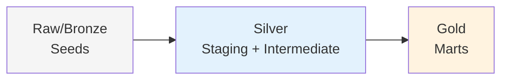

# Design Patterns

This document describes the key architectural patterns used in the dbt Production Blueprint.

## 1. Medallion Architecture

### Pattern Description

Data flows through three layers (bronze → silver → gold), each with increasing refinement and business value:



### Benefits

- **Clear separation** - Each layer has a distinct purpose
- **Reusable intermediate logic** - Business rules centralized
- **Optimized marts** - Analytics-ready for consumption
- **Traceability** - Easy to debug data issues

### Implementation

```
Seeds (Bronze)
    ↓
Staging (Silver) - Standardization
    ↓
Intermediate (Silver) - Business Logic
    ↓
Marts (Gold) - Analytics
```

### When to Use

Always use this pattern for production dbt projects. Never skip layers - always flow through the complete pipeline.

---

## 2. Surrogate Keys

### Pattern Description

Generate stable, hash-based identifiers for entity records using `dbt_utils.generate_surrogate_key()`:

```sql
customer_key as (
    {{ dbt_utils.generate_surrogate_key([
        'customer_id',
        'name'
    ]) }}
)
```

### Benefits

| Benefit | Description |
|---------|-------------|
| **Type Safety** | Integers are faster than strings for joins |
| **Privacy** | No PII in keys (unlike email-based keys) |
| **Stability** | Keys don't change when source data updates |
| **Portability** | Same keys work across data warehouses |
| **Performance** | Hash joins are faster than string joins |

### Implementation

Used in all staging models:

**`stg_customers`**:
```sql
select
    customer_id,
    {{ dbt_utils.generate_surrogate_key(['customer_id', 'name']) }} as customer_key,
    name,
    email,
    region,
    status
from {{ source('raw', 'customers') }}
```

**`stg_orders`**:
```sql
select
    order_id,
    {{ dbt_utils.generate_surrogate_key(['order_id']) }} as order_key,
    customer_id,
    order_date,
    order_total,
    status
from {{ source('raw', 'orders') }}
```

### Best Practices

**Do**:
- ✅ Include natural keys in key generation
- ✅ Use consistent fields across models referencing the same entity
- ✅ Document key composition in model descriptions
- ✅ Use surrogate keys for all fact table foreign keys

**Don't**:
- ❌ Use PII (email, name) alone - combine with natural key
- ❌ Change key composition after deployment
- ❌ Use timestamps that change frequently

### Example: Surrogate Key Usage

```sql
-- Dimension table
select
    customer_key,
    customer_id,
    name,
    email
from {{ ref('dim_customers') }}

-- Fact table referencing dimension
select
    order_key,
    customer_key,  -- Surrogate key, not customer_id
    order_date,
    order_total
from {{ ref('fct_orders') }}
```

---

## 3. Incremental Processing

### Pattern Description

Update fact tables incrementally using merge strategy, only processing new or changed records:

```sql
{{ config(
    materialized='incremental',
    unique_key='order_id',
    strategy='merge'
) }}

select
    order_id,
    customer_id,
    order_total,
    updated_at
from {{ ref('stg_orders') }}


where updated_at > (select max(updated_at) from {{ this }})

```

### Benefits

| Benefit | Description |
|---------|-------------|
| **Performance** | Only process new/changed data |
| **Cost** | Reduced warehouse compute |
| **Scalability** | Handles growing data volumes |
| **Freshness** | Faster data availability |

### Implementation

**`fct_orders`** uses incremental processing:

```sql
{{ config(
    materialized='incremental',
    unique_key='order_id',
    strategy='merge',
    partition_by=['updated_at']
) }}

with orders as (
    select *
    from {{ ref('stg_orders') }}
    
    where updated_at > (select max(updated_at) from {{ this }})
    
)

select
    order_id,
    order_key,
    customer_key,
    order_date,
    order_total,
    currency,
    status,
    is_deleted,
    updated_at
from orders
```

### Incremental Strategies

| Strategy | Use Case | Notes |
|----------|----------|-------|
| **merge** | Default, handles updates | Recommended for most cases |
| **append** | Only new records, no updates | Event streams |
| **delete+insert** | Full reprocess of partition | Partitioned tables |
| **insert_overwrite** | BigQuery-specific | Partition replacement |

### Best Practices

**Do**:
- ✅ Always use `unique_key` for merge strategy
- ✅ Filter on timestamp column when possible
- ✅ Use `--full-refresh` flag for complete rebuilds
- ✅ Monitor incremental runtimes
- ✅ Document incremental logic in model descriptions

**Don't**:
- ❌ Use incremental without a `unique_key`
- ❌ Forget to handle late-arriving data
- ❌ Use incremental for small, static dimensions

### When to Use Full Refresh

```bash
# Schema changes
dbt run --select fct_orders --full-refresh

# Logic changes affecting historical data
dbt run --select fct_orders --full-refresh

# Initial load or backfill
dbt run --select fct_orders --full-refresh
```

---

## 4. Soft Deletes

### Pattern Description

Mark records as deleted without physically removing them:

```sql
case
    when order_status ilike '%canceled%' then true
    when order_status ilike '%returned%' then true
    else false
end as is_deleted
```

### Benefits

| Benefit | Description |
|---------|-------------|
| **Auditability** | Track what was deleted and when |
| **Recoverability** | Can restore deleted records |
| **Data Integrity** | Maintains referential integrity |
| **Analytics** | Can analyze deletion patterns |

### Implementation

**`stg_orders`** adds soft-delete flag:

```sql
select
    order_id,
    order_key,
    customer_id,
    order_date,
    order_total,
    currency,
    status,
    case
        when status ilike '%canceled%' then true
        when status ilike '%returned%' then true
        else false
    end as is_deleted,
    updated_at
from {{ source('raw', 'orders') }}
```

**Downstream filtering**:

```sql
-- Include only active records in metrics
where is_deleted = false

-- Or explicitly include deleted for analysis
where is_deleted = true
```

### Best Practices

**Do**:
- ✅ Document soft-delete logic in model descriptions
- ✅ Filter at mart layer, not staging (keep all data in staging)
- ✅ Consider retention policies for deleted data
- ✅ Use for analysis of deletion trends

**Don't**:
- ❌ Remove soft-deleted records from staging
- ❌ Ignore soft deletes in marts without explicit decision
- ❌ Use physical deletes as the primary mechanism

### Example: Soft Delete Usage

```sql
-- Active orders only (default)
select *
from {{ ref('fct_orders') }}
where is_deleted = false

-- All orders including deleted (for analysis)
select *,
    case when is_deleted then 'Deleted' else 'Active' end as record_status
from {{ ref('fct_orders') }}
```

---

## 5. SCD Type 2 Snapshots

### Pattern Description

Track full history of dimension changes using Slowly Changing Dimension Type 2:

```sql
{{ config(
    unique_key='customer_id',
    strategy='timestamp',
    updated_at='updated_at',
    invalidate_hard_deletes=true
) }}

select *
from {{ ref('stg_customers') }}
```

### Benefits

| Benefit | Description |
|---------|-------------|
| **Historical Analysis** | See changes over time |
| **Point-in-Time** | Reconstruct past states |
| **Auditing** | Track who changed what and when |
| **Regulatory** | Compliance requirements |

### Implementation

**`snap_customers_history`**:

```sql
{{ config(
    target_schema='snapshots',
    unique_key='customer_id',
    strategy='timestamp',
    updated_at='updated_at',
    invalidate_hard_deletes=true
) }}

select
    customer_id,
    name,
    email,
    region,
    status,
    updated_at
from {{ ref('stg_customers') }}
```

### Output Schema

The snapshot produces these additional columns:

| Column | Type | Description |
|--------|------|-------------|
| dbt_valid_from | timestamp | When record became valid |
| dbt_valid_to | timestamp | When record expired (null = current) |
| dbt_scd_id | string | Unique SCD record identifier |

### Querying Snapshots

**Current state**:
```sql
select *
from {{ ref('snap_customers_history') }}
where dbt_valid_to is null
```

**Point-in-time**:
```sql
select *
from {{ ref('snap_customers_history') }}
where dbt_valid_from <= '2024-01-01'
  and (dbt_valid_to > '2024-01-01' or dbt_valid_to is null)
```

**Change history**:
```sql
select
    customer_id,
    name,
    dbt_valid_from,
    dbt_valid_to,
    case
        when lag(name) over (partition by customer_id order by dbt_valid_from) != name
        then 'Name Changed'
    end as change_type
from {{ ref('snap_customers_history') }}
```

### Best Practices

**Do**:
- ✅ Choose appropriate timestamp column
- ✅ Consider retention period for history
- ✅ Monitor snapshot table growth
- ✅ Document what changes are tracked
- ✅ Use `invalidate_hard_deletes=true` for completeness

**Don't**:
- ❌ Snapshot everything (only dimensions that change)
- ❌ Use SCD Type 2 for fact tables
- ❌ Ignore performance impact of large snapshots

---

## 6. Dynamic SQL Generation

### Pattern Description

Generate SQL programmatically based on variables or configuration:

```jinja


  select
    '{{ region }}' as region,
    count(*) as total_orders,
    sum(order_total) as total_revenue
  from {{ ref('fct_orders') }}
  where region = '{{ region }}'
  union all


```

### Benefits

| Benefit | Description |
|---------|-------------|
| **DRY Principle** | Don't Repeat Yourself |
| **Maintainability** | Change in one place |
| **Flexibility** | Easily add/remove regions |
| **Scalability** | Handle many similar entities |

### Implementation

**`region_summary`** uses dynamic SQL:

```sql
{{ generate_region_summary_sql(var('regions')) }}
```

**`int_order_status_categorized`** uses dynamic CASE:

```sql
{{ order_status_case(
    status_groups={
        'completed': ['completed', 'shipped', 'delivered'],
        'open': ['placed', 'confirmed', 'processing'],
        'canceled': ['canceled', 'returned', 'refunded']
    },
    field_name='status'
) }}
```

### Generated SQL Example

**Input**:
```yaml
vars:
  regions:
    - North America
    - EMEA
```

**Output**:
```sql
select 'North America' as region, ...
union all
select 'EMEA' as region, ...
```

### Best Practices

**Do**:
- ✅ Use variables for configuration
- ✅ Document macro inputs/outputs
- ✅ Add inline comments for complex logic
- ✅ Test with various input combinations

**Don't**:
- ❌ Overuse dynamic SQL (keep it readable)
- ❌ Generate SQL without testing edge cases
- ❌ Make dynamic SQL too complex to debug

---

## 7. Contract Enforcement

### Pattern Description

Enforce schema definitions with data types to prevent breaking changes:

```yaml
models:
  - name: fct_orders
    config:
      contract:
        enforced: true
    columns:
      - name: order_id
        data_type: string
        constraints:
          - type: not_null
      - name: order_total
        data_type: decimal(19,2)
```

### Benefits

| Benefit | Description |
|---------|-------------|
| **Type Safety** | Catch type mismatches early |
| **Documentation** | Schema is self-documenting |
| **CI/CD** | Prevent breaking changes |
| **Reliability** | Guarantees contract adherence |

### Implementation

**Global enforcement** in `dbt_project.yml`:

```yaml
models:
  dbt_production_blueprint:
    +contract:
      enforced: true
    +on_schema_change: fail
```

**Model-level definition** in `schema.yml`:

```yaml
models:
  - name: fct_orders
    config:
      contract:
        enforced: true
    columns:
      - name: order_id
        data_type: string
        description: "Unique order identifier"
        tests:
          - not_null
          - unique
      
      - name: order_total
        data_type: decimal(19,2)
        description: "Total order amount"
        tests:
          - dbt_expectations.expect_column_values_to_be_between:
              min_value: 0
```

### Schema Change Behavior

| Setting | Behavior |
|---------|----------|
| `fail` | Fail the run if schema changes (default, recommended) |
| `append` | Add new columns, keep existing |
| `sync` | Add new columns, remove dropped columns |
| `ignore` | Ignore all schema changes |

### Best Practices

**Do**:
- ✅ Document required `data_type` for every column
- ✅ Use appropriate types (decimal for money, etc.)
- ✅ Plan schema changes carefully
- ✅ Use `--full-refresh` when changing contracts

**Don't**:
- ❌ Skip `data_type` definitions
- ❌ Use generic types when specific types are needed
- ❌ Change contracts without coordination

---

## 8. Operational Hooks

### Pattern Description

Execute SQL at specific run points for audit logging, access control, and notifications:

### On-Run-Start Hook

**Purpose**: Log run metadata for operational monitoring

```yaml
# dbt_project.yml
on-run-start:
  - "{{ log_run_start() }}"
```

**Macro** (`macros/audit.sql`):

```sql


    
        insert into {{ target.schema }}.audit_run (
            run_id,
            run_started_at,
            invocation_id,
            target_name,
            target_schema,
            dbt_version
        ) values (
            '{{ invocation_id }}',
            current_timestamp(),
            '{{ invocation_id }}',
            '{{ target.name }}',
            '{{ target.schema }}',
            '{{ dbt_version }}'
        )
    
    
    


```

### Post-Hook (Access Control)

**Purpose**: Grant permissions on model completion

```sql
-- dim_customers.sql
{{ config(
    post_hook="""
        grant select on {{ this }} to role reporter
    """
) }}

select *
from {{ ref('stg_customers') }}
```

### Benefits

| Benefit | Description |
|---------|-------------|
| **Audit Logging** | Track run metadata |
| **Access Control** | Manage permissions automatically |
| **Notifications** | Alert on failures |
| **Cleanup** | Remove temp tables |

### Best Practices

**Do**:
- ✅ Log run metadata for operational visibility
- ✅ Grant least-privilege access
- ✅ Document hook behavior
- ✅ Test hooks in non-production first

**Don't**:
- ❌ Grant excessive permissions
- ❌ Make hooks too complex
- ❌ Skip error handling in hooks

---

## Pattern Summary

| Pattern | Purpose | Used In |
|---------|---------|---------|
| Medallion Architecture | Data flow organization | All models |
| Surrogate Keys | Stable entity identifiers | All staging models |
| Incremental Processing | Efficient updates | `fct_orders` |
| Soft Deletes | Logical deletion | `fct_orders`, `stg_orders` |
| SCD Type 2 | Historical tracking | `snap_customers_history` |
| Dynamic SQL | Flexible code generation | `region_summary`, macros |
| Contract Enforcement | Schema guarantees | All mart models |
| Operational Hooks | Automation | Audit logging, grants |

## Related Documentation

- [Architecture Overview](index.md) - High-level architecture
- [Layers](layers.md) - Detailed layer explanations
- [Model Reference](../reference/models/) - Model-specific patterns
