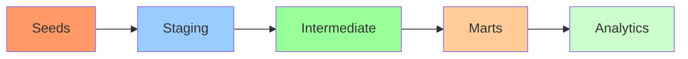

# Getting Started

Welcome to the dbt Production Blueprint! This guide will help you get up and running quickly.

## Choose Your Path

-   :material-rocket-launch:{ .lg .middle } __Quick Start__

    ---

    Get running in 5 minutes with DuckDB

    [:octicons-arrow-right-24: Quick Start](quickstart.md)

-   :material-download:{ .lg .middle } __Full Installation__

    ---

    Detailed setup for production use

    [:octicons-arrow-right-24: Installation](installation.md)

-   :material-cog:{ .lg .middle } __Configuration__

    ---

    Profiles, variables, and settings

    [:octicons-arrow-right-24: Configuration](configuration.md)

## Prerequisites

- **Python**: 3.8 or higher
- **Git**: For cloning the repository
- **Database**: Choose one of the following:
    - DuckDB: No additional setup required (included in requirements)
    - Snowflake: Account credentials needed for production use

## What You'll Learn

1. **Installation** - How to install dbt and dependencies
2. **Configuration** - How to set up profiles for your environment
3. **Loading Data** - How to load sample seed data
4. **Building Models** - How to run models and tests
5. **Documentation** - How to generate and view documentation

## Quick Overview

This project demonstrates production-grade dbt patterns for an e-commerce data warehouse:

### Key Components

- **10 Models** across 3 layers (staging, intermediate, marts)
- **50+ Tests** including custom generic tests and data tests
- **3 Seeds** with intentional data quality issues for demonstration
- **1 Snapshot** for SCD Type 2 customer history tracking
- **7 Macros** for dynamic SQL and reusable logic

## Next Steps

Select your preferred path above, or jump directly to:

- [Architecture Overview](../architecture/index.md) - Understand the data model
- [Data Dictionary](../reference/data-dictionary.md) - Explore all fields and columns
- [Model Reference](../reference/models/staging/index.md) - Detailed model documentation

## Need Help?

- Check [Troubleshooting](../troubleshooting.md) for common issues
- Review [Quick Reference](../reference.md) for command cheat sheet
- Read [Architecture Decisions](../architecture/decisions/adr-001-duckdb-ci.md) to understand design choices
