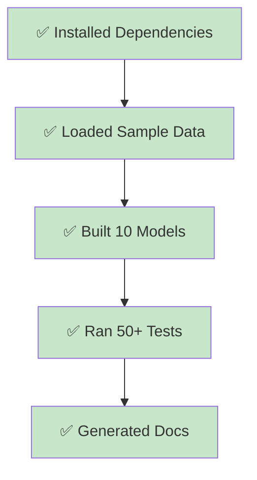

# Quick Start (5 Minutes)

Get up and running with DuckDB in just 5 minutes. No external database required!

## Prerequisites

- Python 3.8 or higher
- Git

## Step-by-Step Guide

### Step 1: Clone and Navigate

```bash
git clone https://github.com/remisharoon/dbt-production-blueprint.git
cd dbt-production-blueprint
```

### Step 2: Install Dependencies

```bash
# Install Python packages (includes dbt-core, dbt-duckdb, and docs tools)
pip install -r requirements.txt

# Install dbt packages (dbt_utils, dbt_expectations, audit_helper)
dbt deps
```

??? note "What gets installed?"
    - `dbt-core` - Core dbt framework
    - `dbt-duckdb` - DuckDB adapter
    - `mkdocs-material` - Documentation site generator
    - `dbt_utils` - Utility macros
    - `dbt_expectations` - Advanced data quality tests

### Step 3: Load Data

```bash
dbt seed
```

This loads 3 CSV files with sample data:
- `raw_customers.csv` - 11 customer records
- `raw_orders.csv` - 12 order records  
- `raw_payments.csv` - 12 payment records

!!! warning "Intentional Data Quality Issues"
    The seed data intentionally contains duplicates, missing values, and inconsistent formatting to demonstrate data cleaning and testing capabilities.

### Step 4: Build Everything

```bash
dbt build
```

This command:
1. Runs all models (staging → intermediate → marts)
2. Executes all tests (50+)
3. Creates snapshots
4. Generates documentation artifacts

You should see output like:
```
Completed successfully

Done. PASS=50 WARN=5 ERROR=0 SKIP=0 TOTAL=55
```

!!! tip "Test Warnings Are Expected"
    Some tests show warnings (not failures) because the seed data has intentional quality issues. This demonstrates real-world data monitoring!

### Step 5: View Documentation

```bash
# Generate dbt documentation
dbt docs generate

# Serve locally
dbt docs serve
```

Visit `http://localhost:8080` to explore:
- Interactive data lineage diagrams
- Model dependencies
- Column descriptions
- Test results

## What Just Happened?



### Models Built

| Layer | Models |
|-------|--------|
| Staging | `stg_customers`, `stg_orders`, `stg_payments` |
| Intermediate | `int_order_payments`, `int_order_status_categorized` |
| Marts Core | `dim_customers`, `fct_orders`, `fct_customer_ltv` |
| Marts Finance | `fct_revenue`, `region_summary` |

### Tests Executed

- **Not Null**: Required fields must have values
- **Unique**: Identifiers must be unique
- **Relationships**: Foreign keys must reference valid records
- **Accepted Values**: Status fields must match allowed values
- **Custom Tests**: Alphanumeric ID validation, type checking

## Verification

Verify your setup:

```bash
# Check dbt version
dbt --version

# Verify connection
dbt debug

# List all models
dbt ls
```

## Next Steps

Now that you're up and running:

1. **Explore the Architecture** - Read about [data layers](../architecture/layers.md) and [patterns](../architecture/patterns.md)
2. **Try Selectors** - Run specific model groups with [selectors](../reference/selectors.md)
3. **Modify a Model** - Make a change and see [state-based selection](configuration.md#state-based-selection) in action
4. **Deploy Docs** - Set up [GitHub Pages deployment](../operations/ci-cd.md)

## Common Commands

```bash
# Run specific model
dbt run --select stg_customers

# Run model + downstream
dbt run --select stg_customers+

# Run tests only
dbt test

# Full refresh (rebuild incremental models)
dbt build --full-refresh

# Generate docs
dbt docs generate
dbt docs serve
```

## Troubleshooting

**Issue**: `dbt deps` fails
- **Solution**: Make sure you installed Python dependencies first with `pip install -r requirements.txt`

**Issue**: Tests fail with errors
- **Solution**: Expected! Some tests are set to `severity: warn`. Check the test output for warnings vs errors.

**Issue**: Can't connect to database
- **Solution**: With DuckDB, no connection needed. Profile is pre-configured in `profiles.yml`.

For more issues, see [Troubleshooting](../troubleshooting.md).
