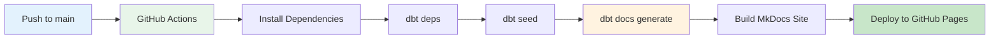

# CI/CD with GitHub Actions

Complete guide to the automated CI/CD pipeline for the dbt Production Blueprint.

## Overview

The documentation site is automatically deployed via GitHub Actions whenever code is pushed to the main branch. The pipeline uses DuckDB for documentation generation, eliminating the need for external database connections.



## Workflow Architecture

### Workflow File

**Path**: `.github/workflows/deploy-docs.yml`

```yaml
name: Deploy Documentation

on:
  push:
    branches: [ main ]
  workflow_dispatch:

permissions:
  contents: read
  pages: write
  id-token: write

concurrency:
  group: "pages"
  cancel-in-progress: false

jobs:
  deploy:
    environment:
      name: github-pages
      url: ${{ steps.deployment.outputs.page_url }}
    runs-on: ubuntu-latest
    steps:
      - name: Checkout
        uses: actions/checkout@v4
      
      - name: Setup Python
        uses: actions/setup-python@v4
        with:
          python-version: '3.11'
      
      - name: Install dependencies
        run: |
          pip install dbt-core dbt-duckdb
          pip install mkdocs-material mkdocs-minify-plugin mkdocs-git-revision-date-localized-plugin
      
      - name: Create DuckDB Profile
        run: |
          mkdir -p ~/.dbt
          cat > ~/.dbt/profiles.yml <<EOF
          dbt_production_blueprint_duckdb:
            target: ci
            outputs:
              ci:
                type: duckdb
                path: ':memory:'
                schema: ci
                threads: 2
          EOF
      
      - name: Install dbt packages
        run: dbt deps
      
      - name: Load seed data
        run: dbt seed --target ci
      
      - name: Generate dbt documentation
        run: dbt docs generate --target ci --target-dir docs/dbt_artifacts
      
      - name: Setup Pages
        uses: actions/configure-pages@v4
      
      - name: Build with MkDocs
        run: mkdocs build
      
      - name: Upload artifact
        uses: actions/upload-pages-artifact@v3
        with:
          path: ./site
      
      - name: Deploy to GitHub Pages
        id: deployment
        uses: actions/deploy-pages@v4
```

## Workflow Steps Explained

### 1. Trigger

```yaml
on:
  push:
    branches: [ main ]
  workflow_dispatch:
```

**Triggers**:
- Push to `main` branch
- Manual trigger via GitHub UI (`workflow_dispatch`)

### 2. Permissions

```yaml
permissions:
  contents: read
  pages: write
  id-token: write
```

**Required for**:
- Reading repository contents
- Deploying to GitHub Pages
- OIDC authentication

### 3. Concurrency Control

```yaml
concurrency:
  group: "pages"
  cancel-in-progress: false
```

**Purpose**: Prevent concurrent deployments that could corrupt the site.

### 4. Python Setup

```yaml
- name: Setup Python
  uses: actions/setup-python@v4
  with:
    python-version: '3.11'
```

**Why 3.11**: Latest stable version with good dbt support.

### 5. Dependency Installation

```yaml
- name: Install dependencies
  run: |
    pip install dbt-core dbt-duckdb
    pip install mkdocs-material mkdocs-minify-plugin mkdocs-git-revision-date-localized-plugin
```

**Packages**:
- `dbt-core`: Core dbt framework
- `dbt-duckdb`: DuckDB adapter for dbt
- `mkdocs-material`: Documentation site generator
- `mkdocs-minify-plugin`: Minify HTML/CSS/JS
- `mkdocs-git-revision-date-localized-plugin`: Show last edit dates

### 6. DuckDB Profile Creation

```yaml
- name: Create DuckDB Profile
  run: |
    mkdir -p ~/.dbt
    cat > ~/.dbt/profiles.yml <<EOF
    dbt_production_blueprint_duckdb:
      target: ci
      outputs:
        ci:
          type: duckdb
          path: ':memory:'
          schema: ci
          threads: 2
    EOF
```

**Key Points**:
- Uses in-memory DuckDB (`:memory:`)
- No persistence needed
- 2 threads for CI efficiency
- No secrets or external DB required

### 7. dbt Dependencies

```yaml
- name: Install dbt packages
  run: dbt deps
```

Installs packages from `packages.yml`:
- dbt_utils
- dbt_expectations
- audit_helper

### 8. Seed Loading

```yaml
- name: Load seed data
  run: dbt seed --target ci
```

Loads sample data into DuckDB for documentation generation.

### 9. Documentation Generation

```yaml
- name: Generate dbt documentation
  run: dbt docs generate --target ci --target-dir docs/dbt_artifacts
```

Generates:
- `index.html`: dbt documentation interface
- `catalog.json`: Column-level metadata
- `manifest.json`: DAG and model definitions

### 10. MkDocs Build

```yaml
- name: Build with MkDocs
  run: mkdocs build
```

Builds the complete documentation site combining:
- Markdown pages from `docs/`
- dbt documentation from `docs/dbt_artifacts/`
- Theme and styling

### 11. GitHub Pages Deployment

```yaml
- name: Deploy to GitHub Pages
  id: deployment
  uses: actions/deploy-pages@v4
```

Deploys the built site to GitHub Pages.

## Benefits of This Approach

### No External Database Required

Traditional approach requires:
```yaml
# ❌ NOT NEEDED
secrets:
  DBT_PROFILES_YML: ${{ secrets.DBT_PROFILES_YML }}
```

Our approach:
```yaml
# ✅ NO SECRETS NEEDED
# DuckDB runs entirely in CI
```

### Faster CI/CD

| Step | With Snowflake | With DuckDB |
|------|----------------|-------------|
| Connect | 2-5 seconds | Instant |
| Seed | 10-30 seconds | 1-2 seconds |
| Docs Generate | 30-60 seconds | 5-10 seconds |
| **Total** | **1-2 minutes** | **10-20 seconds** |

### Lower Cost

- **No cloud database charges**
- **No data transfer costs**
- **No idle compute costs**

### Better Reliability

- No external dependencies
- No network issues
- No credential expiration

## Manual Deployment

You can trigger a manual deployment from the GitHub UI:

1. Go to **Actions** tab
2. Select **Deploy Documentation** workflow
3. Click **Run workflow**
4. Select branch (usually `main`)
5. Click **Run workflow**

## Troubleshooting CI/CD

### Build Failures

**Issue**: `dbt deps` fails
```
Error: No module named 'dbt'
```

**Solution**:
```yaml
# Ensure pip install runs before dbt deps
- name: Install dependencies
  run: |
    pip install dbt-core dbt-duckdb  # Install first!
    pip install mkdocs-material ...
```

---

**Issue**: Profile not found
```
Error: Profile not found: dbt_production_blueprint_duckdb
```

**Solution**:
```yaml
# Ensure profile is created before dbt commands
- name: Create DuckDB Profile
  run: |
    mkdir -p ~/.dbt  # Create directory first
    cat > ~/.dbt/profiles.yml <<EOF
    ...
```

---

**Issue**: MkDocs build fails
```
Error: Config file 'mkdocs.yml' does not exist
```

**Solution**: Ensure `mkdocs.yml` is in repository root and committed.

---

### Deployment Failures

**Issue**: Pages not updating

**Check**:
1. Workflow completed successfully
2. GitHub Pages enabled in settings
3. Source set to "GitHub Actions"

**Settings Path**: Settings → Pages → Build and deployment → Source: GitHub Actions

---

**Issue**: 404 on documentation site

**Solution**:
```yaml
# mkdocs.yml - Ensure this is set
use_directory_urls: false
```

---

## CI/CD Best Practices

### Do

✅ **Use DuckDB for docs generation**
- Faster, cheaper, more reliable

✅ **Pin dependency versions**
```yaml
pip install dbt-core==1.8.0 dbt-duckdb==1.8.0
```

✅ **Test workflow locally**
```bash
# Run same commands locally
pip install dbt-core dbt-duckdb
dbt deps
dbt seed
dbt docs generate --target-dir docs/dbt_artifacts
mkdocs build
```

✅ **Monitor build times**
- Add timing to steps
- Alert on degradation

✅ **Use concurrency control**
- Prevent deployment conflicts

### Don't

❌ **Use production database for docs**
- Unnecessary cost
- Security risk
- Slower builds

❌ **Commit secrets**
```yaml
# ❌ NEVER DO THIS
password: "super_secret_password"
```

❌ **Skip testing locally**
Always test workflow commands locally first.

❌ **Deploy broken builds**
Add tests before deployment step.

## Advanced CI/CD

### Add Link Checking

```yaml
- name: Check links
  run: |
    pip install linkchecker
    mkdocs build
    linkchecker site/
```

### Add Spell Checking

```yaml
- name: Spell check
  run: |
    pip install pyspelling
    pyspelling
```

### Add Markdown Linting

```yaml
- name: Lint Markdown
  run: |
    pip install markdownlint-cli
    markdownlint docs/
```

### Slack Notifications

```yaml
- name: Notify Slack
  if: always()
  uses: 8398a7/action-slack@v3
  with:
    status: ${{ job.status }}
    channel: '#data-engineering'
  env:
    SLACK_WEBHOOK_URL: ${{ secrets.SLACK_WEBHOOK_URL }}
```

## Monitoring

### Build Metrics to Track

| Metric | Target | Alert If |
|--------|--------|----------|
| Build duration | < 2 minutes | > 5 minutes |
| Success rate | > 99% | < 95% |
| Deploy frequency | On every push | Stale for > 7 days |

### GitHub Insights

View workflow metrics:
1. Repository → Actions
2. Select workflow
3. View runs over time

## Related Documentation

- [GitHub Actions Documentation](https://docs.github.com/en/actions)
- [GitHub Pages Documentation](https://docs.github.com/en/pages)
- [DuckDB Documentation](https://duckdb.org/docs/)
- [Hooks Documentation](hooks.md) - Operational hooks
