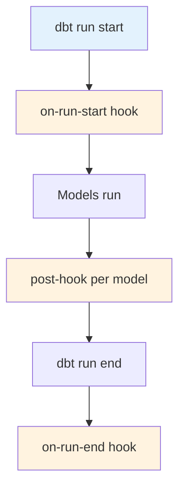

# Operational Hooks

Complete guide to operational hooks for audit logging, access control, and automation.

## Overview

Hooks are SQL statements that execute at specific points in the dbt run lifecycle. They enable:

- **Audit Logging**: Track run metadata
- **Access Control**: Manage database permissions
- **Data Quality**: Run validation checks
- **Notifications**: Alert on completion



## Hook Types

| Hook Type | When It Runs | Use Cases |
|-----------|--------------|-----------|
| `on-run-start` | Before any models | Audit logging, setup |
| `post-hook` | After specific model | Access control, notifications |
| `on-run-end` | After all models | Cleanup, summary |

---

## On-Run-Start Hook

### Purpose

Log run metadata for operational visibility and troubleshooting.

### Implementation

**Location**: `dbt_project.yml`

```yaml
on-run-start:
  - "{{ log_run_start() }}"
```

**Macro**: `macros/audit.sql`

```sql


    
        insert into {{ target.schema }}.audit_run (
            run_id,
            run_started_at,
            invocation_id,
            target_name,
            target_schema,
            dbt_version,
            thread_count
        ) values (
            '{{ invocation_id }}',
            current_timestamp(),
            '{{ invocation_id }}',
            '{{ target.name }}',
            '{{ target.schema }}',
            '{{ dbt_version }}',
            {{ target.threads }}
        )
    
    
    


```

### Audit Table Schema

**Table**: `audit_run`

| Column | Type | Description |
|--------|------|-------------|
| run_id | string | Unique run identifier |
| run_started_at | timestamp | When run started |
| invocation_id | string | dbt invocation ID |
| target_name | string | Target environment (dev, prod) |
| target_schema | string | Schema being written to |
| dbt_version | string | Version of dbt used |
| thread_count | integer | Parallel threads used |

### Sample Data

| run_id | run_started_at | target_name | dbt_version |
|--------|----------------|-------------|-------------|
| abc-123 | 2024-01-15 10:30:00 | dev | 1.8.0 |
| def-456 | 2024-01-15 11:45:00 | prod | 1.8.0 |

### Usage

**Query Run History**:
```sql
SELECT *
FROM audit_run
ORDER BY run_started_at DESC
LIMIT 10;
```

**Monitor Run Frequency**:
```sql
SELECT 
    DATE(run_started_at) as run_date,
    COUNT(*) as run_count,
    AVG(thread_count) as avg_threads
FROM audit_run
GROUP BY 1
ORDER BY 1 DESC;
```

**Track Schema Usage**:
```sql
SELECT 
    target_schema,
    COUNT(*) as run_count
FROM audit_run
WHERE run_started_at > CURRENT_DATE - 30
GROUP BY 1
ORDER BY 2 DESC;
```

### Benefits

- **Operational Visibility**: See when runs occur
- **Troubleshooting**: Debug timing issues
- **Compliance**: Audit trail for data changes
- **Monitoring**: Alert on failed or missing runs

---

## Post-Hooks

### Access Control Hook

**Purpose**: Grant read access to BI tools and analysts.

**Implementation**:

```sql
-- dim_customers.sql
{{ config(
    materialized='table',
    post_hook="""
        grant select on {{ this }} to role reporter
    """
) }}

SELECT *
FROM {{ ref('stg_customers') }}
```

**Generated SQL**:
```sql
-- After model creation
GRANT SELECT ON mart_core.dim_customers TO ROLE reporter;
```

**Usage**:
- Grant to specific roles per model
- Different access for different marts
- Automatic on every run

---

### Notification Hook

**Purpose**: Send alerts when critical models complete.

**Implementation**:

```sql
-- fct_revenue.sql
{{ config(
    materialized='table',
    post_hook="""
        
            insert into alerts.model_completions (
                model_name,
                completed_at,
                row_count
            ) values (
                '{{ this.name }}',
                current_timestamp(),
                (select count(*) from {{ this }})
            )
        
    """
) }}
```

**Conditional Execution**:
- Only runs in production (`target.name == 'prod'`)
- Uses `` for conditional logic
- Prevents noise in dev environments

---

### Data Validation Hook

**Purpose**: Run custom data quality checks after model build.

**Implementation**:

```sql
-- fct_orders.sql
{{ config(
    materialized='incremental',
    post_hook="""
        
            {{ validate_order_totals() }}
        
    """
) }}
```

**Macro**: `macros/validation.sql`

```sql


    SELECT 
        CASE 
            WHEN COUNT(*) > 0 THEN 'FAIL'
            ELSE 'PASS'
        END as result
    FROM {{ this }}
    WHERE order_total < 0





    {{ exceptions.raise_compiler_error("Negative order totals found!") }}


```

**Behavior**:
- Runs after model is built
- Checks for invalid data
- Fails the run if issues found

---

## On-Run-End Hook

### Purpose

Execute cleanup or summary operations after all models complete.

### Example: Run Summary

```yaml
# dbt_project.yml
on-run-end:
  - "{{ log_run_end() }}"
```

**Macro**: `macros/audit.sql`

```sql


    
        update {{ target.schema }}.audit_run
        set run_completed_at = current_timestamp(),
            duration_seconds = datediff('second', run_started_at, current_timestamp()),
            models_run = {{ models | length }},
            models_passed = {{ (models | selectattr('status', 'equalto', 'success') | list) | length }},
            models_failed = {{ (models | selectattr('status', 'equalto', 'error') | list) | length }}
        where run_id = '{{ invocation_id }}'
    
    
    


```

### Example: Cleanup Temporary Tables

```yaml
# dbt_project.yml
on-run-end:
  - "drop table if exists {{ target.schema }}.temp_staging_data"
```

---

## Hook Best Practices

### Do

✅ **Use hooks for cross-cutting concerns**
- Logging
- Access control
- Validation

✅ **Make hooks idempotent**
```sql
-- Good: DROP IF EXISTS
DROP TABLE IF EXISTS temp_table;

-- Bad: Will fail on second run
DROP TABLE temp_table;
```

✅ **Use conditionals for environment-specific behavior**
```sql

    -- Only in production

```

✅ **Test hooks locally**
```bash
dbt run --select your_model
-- Verify hook executed
```

✅ **Document hook behavior**
```sql
/*
Post-hook: Grants SELECT to reporter role
Purpose: Enable BI tool access
*/
```

### Don't

❌ **Put business logic in hooks**
- Keep hooks focused on operational concerns

❌ **Make hooks too complex**
- Simple SQL statements work best
- Complex logic belongs in models

❌ **Ignore hook failures**
- Failed hooks can fail the entire run

❌ **Use hooks for data transformation**
- Transform data in models, not hooks

---

## Advanced Hook Patterns

### Multi-Step Hooks

```yaml
post_hook:
  - "grant select on {{ this }} to role analyst"
  - "grant select on {{ this }} to role reporter"
  - "comment on table {{ this }} is 'Revenue data for executive reporting'"
```

### Dynamic Hook Generation

```sql


  grant select on {{ this }} to role {{ role }};



-- Usage
{{ config(
    post_hook="{{ grant_to_roles(['analyst', 'reporter', 'executive']) }}"
) }}
```

### Hook with Variables

```yaml
vars:
  notification_email: 'data-team@company.com'

on-run-end:
  - "insert into notifications.email_log (email, message) values ('{{ var('notification_email') }}', 'Run completed')"
```

---

## Hook Troubleshooting

### Hook Not Executing

**Check**:
1. Hook defined in correct location
2. Model actually running (not cached)
3. No syntax errors in hook SQL

**Debug**:
```bash
dbt run --select your_model --debug
```

### Hook SQL Errors

**Issue**: Hook fails but model succeeds

**Solution**: Test hook SQL independently
```sql
-- Run this in your warehouse
grant select on schema.table to role reporter;
```

### Conditional Hooks Not Working

**Check**: `execute` variable
```sql
  -- Must be present
    -- Hook logic

```

---

## Monitoring Hooks

### Query Audit Log

```sql
-- Find recent runs
SELECT *
FROM audit_run
WHERE run_started_at > CURRENT_DATE - 7
ORDER BY run_started_at DESC;
```

### Find Long-Running Runs

```sql
SELECT 
    run_id,
    target_name,
    duration_seconds / 60.0 as duration_minutes
FROM audit_run
WHERE duration_seconds > 300  -- > 5 minutes
ORDER BY duration_seconds DESC;
```

### Failed Runs

```sql
SELECT *
FROM audit_run
WHERE models_failed > 0
ORDER BY run_started_at DESC;
```

---

## Related Documentation

- [dbt Hooks Documentation](https://docs.getdbt.com/reference/project-configs/on-run-start-on-run-end)
- [dbt Project Configs](https://docs.getdbt.com/reference/dbt_project.yml)
- [CI/CD Documentation](ci-cd.md) - Deployment automation
- [Audit Helper Package](https://github.com/dbt-labs/dbt-audit-helper) - Additional audit utilities
