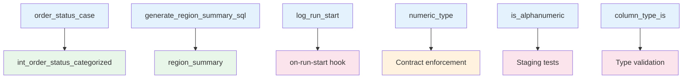

# Macro Reference

Complete API reference for all macros in the dbt Production Blueprint.

## Overview

Macros are reusable pieces of Jinja-SQL code that generate dynamic SQL. They help maintain DRY (Don't Repeat Yourself) principles and enable powerful abstractions.

## Macro Categories

| Category | Macros | Purpose |
|----------|--------|---------|
| **Operational** | 1 | Audit logging, hooks |
| **Business Logic** | 2 | Dynamic SQL generation |
| **Utilities** | 1 | Adapter-specific functions |
| **Testing** | 2 | Custom data tests |

---

## Operational Macros

### `log_run_start()`

Logs run metadata to the `audit_run` table for operational visibility.

**Purpose**: On-run-start hook for tracking dbt runs

**Location**: `macros/audit.sql`

**Usage**:

```yaml
# dbt_project.yml
on-run-start:
  - "{{ log_run_start() }}"
```

**Generated SQL** (example):

```sql
INSERT INTO main.audit_run (
    run_id,
    run_started_at,
    invocation_id,
    target_name,
    target_schema,
    dbt_version
) VALUES (
    'abc-123-xyz',
    '2024-01-15 10:30:00',
    'abc-123-xyz',
    'dev',
    'main',
    '1.8.0'
);
```

**Output Table**: `audit_run`

| Column | Type | Description |
|--------|------|-------------|
| run_id | string | Unique run identifier |
| run_started_at | timestamp | Run start time |
| invocation_id | string | dbt invocation ID |
| target_name | string | Target environment |
| target_schema | string | Target schema |
| dbt_version | string | dbt version used |

**Source Code**:

```jinja


    
        insert into {{ target.schema }}.audit_run (
            run_id,
            run_started_at,
            invocation_id,
            target_name,
            target_schema,
            dbt_version
        ) values (
            '{{ invocation_id }}',
            current_timestamp(),
            '{{ invocation_id }}',
            '{{ target.name }}',
            '{{ target.schema }}',
            '{{ dbt_version }}'
        )
    
    
    


```

**When to Use**:
- Operational monitoring
- Run tracking and auditing
- Integration with orchestration tools
- Debugging and troubleshooting

---

## Business Logic Macros

### `order_status_case()`

Generates dynamic CASE statement for categorizing order statuses.

**Purpose**: Centralize status grouping logic

**Location**: `macros/status_case.sql`

**Signature**:

```jinja
{{ order_status_case(status_groups, field_name) }}
```

**Parameters**:

| Parameter | Type | Required | Description |
|-----------|------|----------|-------------|
| `status_groups` | dict | Yes | Mapping of categories to status lists |
| `field_name` | string | Yes | Column name to categorize |

**Usage Example**:

```sql
-- int_order_status_categorized.sql
select
    order_id,
    status as order_status,
    {{ order_status_case(
        status_groups={
            'completed': ['completed', 'shipped', 'delivered'],
            'open': ['placed', 'confirmed', 'processing'],
            'canceled': ['canceled', 'returned', 'refunded']
        },
        field_name='status'
    ) }} as status_category,
    updated_at
from {{ ref('stg_orders') }}
```

**Generated SQL**:

```sql
CASE
    WHEN status IN ('completed', 'shipped', 'delivered') THEN 'completed'
    WHEN status IN ('placed', 'confirmed', 'processing') THEN 'open'
    WHEN status IN ('canceled', 'returned', 'refunded') THEN 'canceled'
END as status_category
```

**Source Code**:

```jinja

CASE
    
        WHEN {{ field_name }} IN (
            
                '{{ status }}'
                , 
            
        ) THEN '{{ category }}'
    
END

```

**Benefits**:
- Centralize status mapping logic
- Easy to add new categories
- Consistent across models
- Self-documenting

---

### `generate_region_summary_sql()`

Generates UNION ALL SQL for region rollup aggregations.

**Purpose**: Dynamic SQL generation for configurable regions

**Location**: `macros/generate_schema.sql`

**Signature**:

```jinja
{{ generate_region_summary_sql(regions) }}
```

**Parameters**:

| Parameter | Type | Required | Description |
|-----------|------|----------|-------------|
| `regions` | list | Yes | List of region names to generate queries for |

**Usage Example**:

```sql
-- region_summary.sql
{{ generate_region_summary_sql(var('regions')) }}
```

**With Variable Configuration**:

```yaml
# dbt_project.yml
vars:
  regions:
    - North America
    - EMEA
    - APAC
    - LATAM
```

**Generated SQL** (with 2 regions):

```sql
SELECT 
    'North America' as region,
    SUM(order_total) as total_revenue,
    COUNT(DISTINCT order_id) as total_orders,
    COUNT(DISTINCT customer_id) as total_customers,
    AVG(order_total) as avg_order_value
FROM {{ ref('fct_orders') }}
WHERE region = 'North America'

UNION ALL

SELECT 
    'EMEA' as region,
    SUM(order_total) as total_revenue,
    COUNT(DISTINCT order_id) as total_orders,
    COUNT(DISTINCT customer_id) as total_customers,
    AVG(order_total) as avg_order_value
FROM {{ ref('fct_orders') }}
WHERE region = 'EMEA'
```

**Source Code**:

```jinja


    SELECT 
        '{{ region }}' as region,
        SUM(order_total) as total_revenue,
        COUNT(DISTINCT order_id) as total_orders,
        COUNT(DISTINCT customer_id) as total_customers,
        AVG(order_total) as avg_order_value
    FROM {{ ref('fct_orders') }}
    WHERE region = '{{ region }}'
    UNION ALL


```

**Benefits**:
- Configurable regions via variables
- DRY - Write query once, generate for all regions
- Easy to add/remove regions
- Type-safe SQL generation

**Runtime Override**:

```bash
# Override regions at runtime
dbt run --select region_summary --vars '{regions: ["North America", "EMEA"]}'
```

---

## Utility Macros

### `numeric_type()`

Adapter-dispatched macro for numeric data types.

**Purpose**: Handle type differences across warehouses

**Location**: `macros/utils/data_types.sql`

**Signature**:

```jinja
{{ numeric_type(precision, scale) }}
```

**Parameters**:

| Parameter | Type | Required | Description |
|-----------|------|----------|-------------|
| `precision` | integer | Yes | Total number of digits |
| `scale` | integer | Yes | Number of decimal places |

**Usage Example**:

```sql
{{ config(
    materialized='table',
    contract={
        'enforced': true
    }
) }}

SELECT
    order_id,
    CAST(order_total AS {{ numeric_type(19, 2) }}) as order_total
FROM {{ ref('stg_orders') }}
```

**Output by Warehouse**:

| Warehouse | Output |
|-----------|--------|
| DuckDB | `DECIMAL(19, 2)` |
| Snowflake | `NUMBER(19, 2)` |
| PostgreSQL | `NUMERIC(19, 2)` |
| BigQuery | `NUMERIC(19, 2)` |
| Default | `NUMERIC(19, 2)` |

**Source Code**:

```jinja

    {{ return(adapter.dispatch('numeric_type', 'dbt')(precision, scale)) }}



    numeric({{ precision }}, {{ scale }})



    decimal({{ precision }}, {{ scale }})



    number({{ precision }}, {{ scale }})

```

**Why Use This?**:
- Cross-warehouse compatibility
- Type consistency in contracts
- Single source of type definitions

---

## Testing Macros

### `is_alphanumeric()`

Custom generic test validating that a column contains only alphanumeric characters.

**Purpose**: Validate ID format (customer_id, order_id, payment_id)

**Location**: `macros/tests/is_alphanumeric.sql`

**Signature**:

```yaml
columns:
  - name: customer_id
    tests:
      - is_alphanumeric
```

**Parameters**:

| Parameter | Type | Required | Default | Description |
|-----------|------|----------|---------|-------------|
| `column_name` | string | Yes | - | Column to test |
| `model` | string | Yes | - | Model name (auto-populated) |

**Usage**:

```yaml
# schema.yml
models:
  - name: stg_customers
    columns:
      - name: customer_id
        tests:
          - not_null
          - is_alphanumeric  # Custom test
```

**Source Code**:

```jinja




    select *
    from {{ model }}
    where not regexp_matches({{ column_name }}, '^[a-zA-Z0-9]+$')


    select *
    from {{ model }}
    where {{ column_name }} !~ '^[a-zA-Z0-9]+$'


    select *
    from {{ model }}
    where not regexp_like({{ column_name }}, '^[a-zA-Z0-9]+$')




```

**Supported Warehouses**:
- DuckDB ✓
- PostgreSQL ✓
- Snowflake ✓ (default)
- Other warehouses (using default)

---

### `column_type_is()`

Custom generic test validating that a column has the expected data type.

**Purpose**: Ensure column types match contract definitions

**Location**: `macros/tests/column_type_is.sql`

**Signature**:

```yaml
columns:
  - name: order_total
    tests:
      - column_type_is:
          data_type: decimal(19,2)
```

**Parameters**:

| Parameter | Type | Required | Description |
|-----------|------|----------|-------------|
| `column_name` | string | Yes | Column to test |
| `model` | string | Yes | Model name (auto-populated) |
| `data_type` | string | Yes | Expected data type |

**Usage**:

```yaml
# schema.yml
models:
  - name: fct_orders
    columns:
      - name: order_total
        tests:
          - column_type_is:
              data_type: decimal(19,2)
      
      - name: customer_key
        tests:
          - column_type_is:
              data_type: varchar
```

**Source Code**:

```jinja


select *
from {{ model }}
where {{ column_name }} is not null
  and typeof({{ column_name }}) != '{{ data_type }}'


```

**Note**: Implementation varies by warehouse. Some use `information_schema` for type checking.

---

## Creating Custom Macros

### Best Practices

**Do**:
- ✅ Document parameters and return values
- ✅ Provide usage examples
- ✅ Use descriptive names
- ✅ Handle edge cases
- ✅ Add adapter dispatch for cross-warehouse support
- ✅ Test macros with different inputs

**Don't**:
- ❌ Make macros too complex
- ❌ Use global variables without documentation
- ❌ Forget to handle null cases
- ❌ Generate invalid SQL

### Macro Template

```jinja

{#-
    Brief description of what this macro does.
    
    Args:
        param1: Description of param1 (required)
        param2: Description of param2 (optional, default: 'default')
    
    Returns:
        Description of return value
    
    Example:
        {{ my_macro('value1', 'value2') }}
-#}

-- Macro logic here
select '{{ param1 }}' as col1

     , '{{ param2 }}' as col2



```

### Adding Macros to the Project

1. Create file: `macros/my_macro_category/my_macro.sql`
2. Add documentation header
3. Write macro logic
4. Add usage example
5. Test with `dbt compile`

---

## Macro Dependencies

### External Packages

| Package | Macros Used |
|---------|-------------|
| `dbt_utils` | `generate_surrogate_key` |
| `dbt_expectations` | Various test macros |
| `audit_helper` | Audit utilities |

### Internal Dependencies



---

## Related Documentation

- [Data Dictionary](data-dictionary.md) - All columns and fields
- [Testing Strategy](tests.md) - Custom and built-in tests
- [dbt Macro Documentation](https://docs.getdbt.com/docs/build/jinja-macros)
