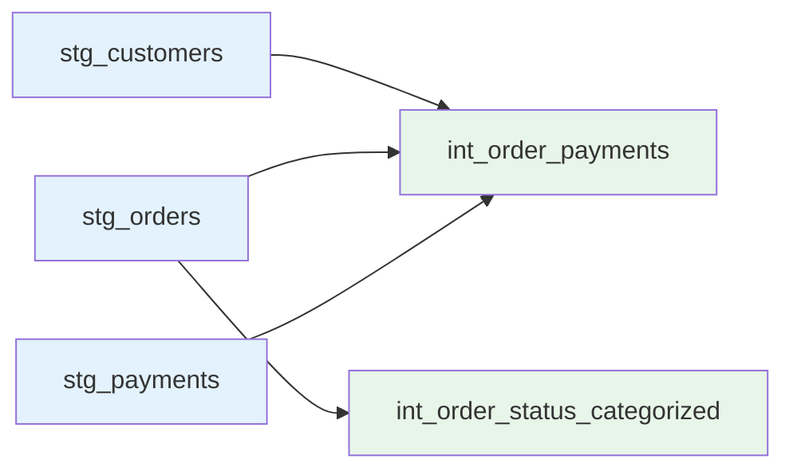

# Intermediate Models

Reference documentation for all intermediate layer models.

## Overview

Intermediate models apply business logic and create reusable transformations between staging and marts layers.



## Model List

| Model | Inputs | Outputs | Purpose |
|-------|--------|---------|---------|
| [int_order_payments](#int_order_payments) | stg_orders, stg_payments | Order-level payment metrics | Payment aggregation |
| [int_order_status_categorized](#int_order_status_categorized) | stg_orders | Status categories | Status grouping |

---

## int_order_payments

Aggregates payments at the order level with coverage metrics.

### Model Details

**Path**: `models/intermediate/int_order_payments.sql`

**Schema**: `int`

**Materialization**: View

**Lineage**:
- Inputs: `stg_orders`, `stg_payments`
- Outputs: `fct_orders`, `fct_revenue`

### Business Logic

1. **Payment Aggregation**
   ```sql
   SUM(p.amount) as total_payments
   ```

2. **Payment Coverage**
   ```sql
   (total_payments / NULLIF(o.order_total, 0)) * 100 as payment_coverage
   ```

3. **Payment Status**
   ```sql
   CASE
       WHEN total_payments >= o.order_total THEN 'paid'
       WHEN total_payments > 0 THEN 'partial'
       ELSE 'unpaid'
   END as payment_status
   ```

4. **Refund Tracking**
   ```sql
   SUM(CASE WHEN p.payment_method = 'coupon' THEN p.amount ELSE 0 END) as refund_amount
   ```

5. **Chargeback Tracking**
   ```sql
   SUM(CASE WHEN p.payment_method = 'bank_transfer' AND p.amount < 0 
       THEN ABS(p.amount) ELSE 0 END) as chargeback_amount
   ```

### Columns

| Column | Type | Description | Calculation |
|--------|------|-------------|-------------|
| order_id | string | Order identifier | From stg_orders |
| order_key | string | Order surrogate key | From stg_orders |
| order_total | decimal | Original order amount | From stg_orders |
| total_payments | decimal | Sum of all payments | SUM(payment.amount) |
| payment_coverage | decimal | Payment percentage | (total_payments / order_total) * 100 |
| payment_status | string | paid, partial, unpaid | Based on coverage |
| refund_amount | decimal | Total refunds | Sum of coupon/refund payments |
| chargeback_amount | decimal | Total chargebacks | Sum of negative bank transfers |

### Join Logic

```sql
FROM {{ ref('stg_orders') }} o
LEFT JOIN {{ ref('stg_payments') }} p
    ON o.order_id = p.order_id
GROUP BY o.order_id, o.order_key, o.order_total
```

**Join Type**: LEFT JOIN
- Reason: Orders may exist without payments (e.g., cash orders not yet recorded)
- Cardinality: One order → Many payments

### Tests

```yaml
models:
  - name: int_order_payments
    columns:
      - name: order_id
        tests:
          - not_null
          - unique
      
      - name: payment_coverage
        tests:
          - dbt_expectations.expect_column_values_to_be_between:
              min_value: 0
              max_value: 200
      
      - name: payment_status
        tests:
          - accepted_values:
              values: ['paid', 'partial', 'unpaid']
```

### Usage Examples

**Payment Status Breakdown**:
```sql
SELECT 
    payment_status,
    COUNT(*) as order_count,
    AVG(payment_coverage) as avg_coverage
FROM {{ ref('int_order_payments') }}
GROUP BY payment_status
```

**Overpaid Orders**:
```sql
SELECT *
FROM {{ ref('int_order_payments') }}
WHERE payment_coverage > 100
```

**Unpaid Orders**:
```sql
SELECT *
FROM {{ ref('int_order_payments') }}
WHERE payment_status = 'unpaid'
```

### Downstream Usage

Used by:
- `fct_orders` - Includes payment metrics
- `fct_revenue` - Filters to fully paid orders

---

## int_order_status_categorized

Categorizes order statuses into high-level groups using dynamic SQL.

### Model Details

**Path**: `models/intermediate/int_order_status_categorized.sql`

**Schema**: `int`

**Materialization**: View

**Lineage**:
- Inputs: `stg_orders`
- Outputs: `fct_orders`

### Business Logic

Uses `order_status_case()` macro to categorize statuses:

```sql
SELECT
    order_id,
    status as order_status,
    {{ order_status_case(
        status_groups={
            'completed': ['completed', 'shipped', 'delivered'],
            'open': ['placed', 'confirmed', 'processing'],
            'canceled': ['canceled', 'returned', 'refunded']
        },
        field_name='status'
    ) }} as status_category,
    updated_at
FROM {{ ref('stg_orders') }}
```

### Status Mapping

| Original Status | Category | Description |
|----------------|----------|-------------|
| completed | completed | Order fulfilled |
| shipped | completed | Order in transit |
| delivered | completed | Order received |
| placed | open | Order created |
| confirmed | open | Order confirmed |
| processing | open | Order being prepared |
| canceled | canceled | Order canceled |
| returned | canceled | Order returned |
| refunded | canceled | Order refunded |

### Columns

| Column | Type | Description | Source |
|--------|------|-------------|--------|
| order_id | string | Order identifier | stg_orders |
| order_status | string | Original status | stg_orders.status |
| status_category | string | Categorized status | Generated by macro |
| updated_at | timestamp | Last update | stg_orders.updated_at |

### Tests

```yaml
models:
  - name: int_order_status_categorized
    columns:
      - name: order_id
        tests:
          - not_null
          - unique
      
      - name: status_category
        tests:
          - not_null
          - accepted_values:
              values: ['completed', 'open', 'canceled']
```

### Macro Details

The `order_status_case()` macro generates a CASE statement:

```sql
CASE
    WHEN status IN ('completed', 'shipped', 'delivered') THEN 'completed'
    WHEN status IN ('placed', 'confirmed', 'processing') THEN 'open'
    WHEN status IN ('canceled', 'returned', 'refunded') THEN 'canceled'
END as status_category
```

**Benefits**:
- Centralize status mapping logic
- Easy to add new statuses
- Consistent across all models

### Usage Examples

**Orders by Category**:
```sql
SELECT 
    status_category,
    COUNT(*) as order_count
FROM {{ ref('int_order_status_categorized') }}
GROUP BY status_category
```

**Open Orders**:
```sql
SELECT *
FROM {{ ref('int_order_status_categorized') }}
WHERE status_category = 'open'
```

**Category Transition Time**:
```sql
SELECT 
    order_id,
    order_status,
    status_category,
    updated_at,
    LAG(status_category) OVER (PARTITION BY order_id ORDER BY updated_at) as previous_category
FROM {{ ref('int_order_status_categorized') }}
```

### Downstream Usage

Used by:
- `fct_orders` - Includes status_category for filtering and analysis

---

## Intermediate Layer Patterns

### Pattern 1: Aggregation

**`int_order_payments`** demonstrates aggregating child records to parent level:

```sql
-- Aggregate payments to order level
SELECT 
    order_id,
    SUM(amount) as total_payments
FROM payments
GROUP BY order_id
```

### Pattern 2: Categorization

**`int_order_status_categorized`** demonstrates using macros for business logic:

```sql
-- Use macro for dynamic categorization
{{ order_status_case(status_groups, field_name) }} as category
```

### Pattern 3: Multi-Source Joins

Intermediate models often join multiple staging tables:

```sql
FROM orders o
LEFT JOIN payments p ON o.id = p.order_id
LEFT JOIN customers c ON o.customer_id = c.id
```

---

## Testing Summary

### Intermediate Layer Test Coverage

| Model | Tests | Type | Notes |
|-------|-------|------|-------|
| int_order_payments | 5 | Generic + expectations | Payment coverage 0-200% |
| int_order_status_categorized | 4 | Generic + accepted_values | 3 categories |

### Test Details

**int_order_payments**:
- not_null: order_id
- unique: order_id
- expect_between: payment_coverage [0, 200]
- accepted_values: payment_status [paid, partial, unpaid]

**int_order_status_categorized**:
- not_null: order_id, status_category
- unique: order_id
- accepted_values: status_category [completed, open, canceled]

---

## Related Documentation

- [Macro Reference](../../macros.md) - order_status_case macro
- [Data Dictionary](../../data-dictionary.md) - All column definitions
- [Testing Strategy](../../tests.md) - Testing approach
- [Marts Core](../marts-core/index.md) - Next layer
- [Architecture Overview](../../../architecture/index.md) - Layer explanation
