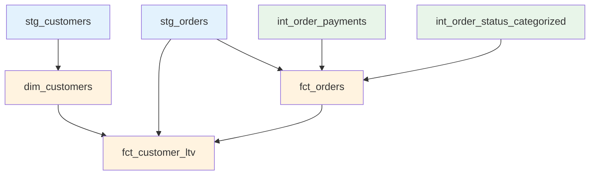

# Core Marts

Reference documentation for all core marts models (dimensions and facts).

## Overview

Core marts provide analytics-ready tables for business intelligence and reporting. They are materialized as tables for performance.



## Model List

| Model | Type | Schema | Purpose |
|-------|------|--------|---------|
| [dim_customers](#dim_customers) | Dimension | mart_core | Customer master data |
| [fct_orders](#fct_orders) | Fact (Incremental) | mart_core | Order transactions |
| [fct_customer_ltv](#fct_customer_ltv) | Fact | mart_core | Customer lifetime value |

---

## dim_customers

Customer dimension with latest state and access control.

### Model Details

**Path**: `models/marts/core/dim_customers.sql`

**Type**: Dimension (Type 1 - Current state only)

**Schema**: `mart_core`

**Materialization**: Table

**Lineage**:
- Input: `stg_customers`
- Referenced by: `fct_orders`, `fct_customer_ltv`, `fct_revenue`

### Business Logic

1. **Deduplication**
   ```sql
   -- Keep latest record per customer
   QUALIFY ROW_NUMBER() OVER (
       PARTITION BY customer_id 
       ORDER BY updated_at DESC
   ) = 1
   ```

2. **Order Metrics**
   ```sql
   -- Calculate first and last order dates
   MIN(o.order_date) as first_order_date,
   MAX(o.order_date) as last_order_date
   ```

### Columns

| Column | Type | Description | Source |
|--------|------|-------------|--------|
| customer_id | string | Natural key | stg_customers |
| customer_key | string | Surrogate key | stg_customers |
| name | string | Customer name | stg_customers |
| email | string | Email address | stg_customers |
| region | string | Geographic region | stg_customers |
| status | string | active/inactive | stg_customers |
| first_order_date | date | First purchase | Calculated from orders |
| last_order_date | date | Latest purchase | Calculated from orders |

### Configuration

```yaml
{{ config(
    materialized='table',
    schema='mart_core',
    post_hook="grant select on {{ this }} to role reporter"
) }}
```

**Access Control**:
- Post-hook grants SELECT to `reporter` role
- Ensures BI tools and analysts can query

### Tests

```yaml
models:
  - name: dim_customers
    columns:
      - name: customer_id
        tests:
          - not_null
          - unique
      
      - name: customer_key
        tests:
          - not_null
          - unique
      
      - name: region
        tests:
          - accepted_values:
              values: ['North America', 'EMEA', 'APAC', 'LATAM']
```

### Usage Examples

**Active Customers**:
```sql
SELECT *
FROM {{ ref('dim_customers') }}
WHERE status = 'active'
```

**Customers by Region**:
```sql
SELECT 
    region,
    COUNT(*) as customer_count
FROM {{ ref('dim_customers') }}
GROUP BY region
```

**Recent Customers** (ordered in last 30 days):
```sql
SELECT *
FROM {{ ref('dim_customers') }}
WHERE last_order_date >= CURRENT_DATE - 30
```

**Customer with Order History**:
```sql
SELECT 
    c.customer_id,
    c.name,
    c.first_order_date,
    c.last_order_date,
    COUNT(o.order_id) as total_orders
FROM {{ ref('dim_customers') }} c
LEFT JOIN {{ ref('fct_orders') }} o 
    ON c.customer_key = o.customer_key
GROUP BY c.customer_id, c.name, c.first_order_date, c.last_order_date
```

---

## fct_orders

Order fact table with incremental processing and soft-delete handling.

### Model Details

**Path**: `models/marts/core/fct_orders.sql`

**Type**: Fact (Transactional)

**Schema**: `mart_core`

**Materialization**: Incremental Table

**Lineage**:
- Inputs: `stg_orders`, `int_order_payments`, `int_order_status_categorized`
- Referenced by: `fct_customer_ltv`, `fct_revenue`, `region_summary`

### Incremental Configuration

```yaml
{{ config(
    materialized='incremental',
    unique_key='order_id',
    strategy='merge',
    partition_by=['updated_at'],
    on_schema_change='fail'
) }}
```

**Strategy**:
- **Type**: Incremental with merge
- **Unique Key**: `order_id`
- **Partition By**: `updated_at` (for query optimization)
- **Filter**: `updated_at > (SELECT MAX(updated_at) FROM {{ this }})`

### Business Logic

1. **Surrogate Key Join**
   ```sql
   -- Join to dim_customers using surrogate key
   c.customer_key
   ```

2. **Payment Metrics**
   ```sql
   -- Include payment rollups from intermediate
   p.total_payments,
   p.payment_coverage,
   p.payment_status
   ```

3. **Status Category**
   ```sql
   -- Include categorized status
   sc.status_category
   ```

4. **Incremental Filter**
   ```sql
   
   WHERE updated_at > (
       SELECT MAX(updated_at) 
       FROM {{ this }}
   )
   
   ```

### Columns

| Column | Type | Description | Source |
|--------|------|-------------|--------|
| order_id | string | Natural key | stg_orders |
| order_key | string | Surrogate key | stg_orders |
| customer_key | string | Customer FK | dim_customers |
| order_date | date | Order date | stg_orders |
| order_total | decimal(19,2) | Order amount | stg_orders |
| currency | string | Currency code | stg_orders |
| status | string | Order status | stg_orders |
| is_deleted | boolean | Soft delete flag | stg_orders |
| total_payments | decimal(19,2) | Sum of payments | int_order_payments |
| payment_coverage | decimal | Payment % | int_order_payments |
| updated_at | timestamp | Last update | stg_orders |

### Contract

```yaml
models:
  - name: fct_orders
    config:
      contract:
        enforced: true
    columns:
      - name: order_id
        data_type: string
      - name: order_total
        data_type: decimal(19,2)
      - name: total_payments
        data_type: decimal(19,2)
```

### Tests

```yaml
models:
  - name: fct_orders
    columns:
      - name: order_id
        tests:
          - not_null
          - unique
      
      - name: customer_key
        tests:
          - not_null
          - relationships:
              to: ref('dim_customers')
              field: customer_key
      
      - name: order_total
        tests:
          - not_null
          - dbt_expectations.expect_column_values_to_be_between:
              min_value: 0
      
      - name: payment_coverage
        tests:
          - dbt_expectations.expect_column_values_to_be_between:
              min_value: 0
              max_value: 200
```

### Usage Examples

**Active Orders Only**:
```sql
SELECT *
FROM {{ ref('fct_orders') }}
WHERE is_deleted = FALSE
```

**Paid Orders**:
```sql
SELECT *
FROM {{ ref('fct_orders') }}
WHERE payment_status = 'paid'
```

**Orders with Customer Info**:
```sql
SELECT 
    o.*,
    c.name as customer_name,
    c.region as customer_region
FROM {{ ref('fct_orders') }} o
JOIN {{ ref('dim_customers') }} c 
    ON o.customer_key = c.customer_key
```

**Daily Order Metrics**:
```sql
SELECT 
    order_date,
    COUNT(*) as order_count,
    SUM(order_total) as total_revenue,
    AVG(order_total) as avg_order_value
FROM {{ ref('fct_orders') }}
WHERE is_deleted = FALSE
GROUP BY order_date
ORDER BY order_date
```

**Overdue Payments**:
```sql
SELECT *
FROM {{ ref('fct_orders') }}
WHERE payment_status IN ('partial', 'unpaid')
  AND order_date < CURRENT_DATE - 30
```

### Incremental Behavior

**First Run** (Full Load):
```
SELECT * FROM stg_orders  -- All records
```

**Subsequent Runs** (Incremental):
```
SELECT * FROM stg_orders
WHERE updated_at > '2024-01-14 10:00:00'  -- Only new/updated
```

**Full Refresh**:
```bash
dbt run --select fct_orders --full-refresh
```

---

## fct_customer_ltv

Customer lifetime value metrics for cohort analysis and segmentation.

### Model Details

**Path**: `models/marts/core/fct_customer_ltv.sql`

**Type**: Fact (Aggregated)

**Schema**: `mart_core`

**Materialization**: Table

**Lineage**:
- Inputs: `dim_customers`, `stg_orders`, `fct_orders`
- Referenced by: Customer analytics, segmentation

### Business Logic

1. **Net Revenue Calculation**
   ```sql
   SUM(o.order_total - COALESCE(o.refund_amount, 0)) as total_revenue
   ```

2. **Order Count**
   ```sql
   COUNT(DISTINCT o.order_id) as total_orders
   ```

3. **Average Order Value**
   ```sql
   AVG(o.order_total) as avg_order_value
   ```

4. **Lifetime Value**
   ```sql
   -- Same as total_revenue (net of refunds)
   SUM(o.order_total - COALESCE(o.refund_amount, 0)) as lifetime_value
   ```

5. **Date Range**
   ```sql
   MIN(o.order_date) as first_order_date,
   MAX(o.order_date) as last_order_date
   ```

### Columns

| Column | Type | Description | Calculation |
|--------|------|-------------|-------------|
| customer_id | string | Customer natural key | dim_customers |
| customer_key | string | Customer surrogate key | dim_customers |
| total_revenue | decimal(19,2) | Net revenue | SUM(order_total - refunds) |
| total_orders | integer | Order count | COUNT(orders) |
| avg_order_value | decimal(19,2) | Average order | AVG(order_total) |
| lifetime_value | decimal(19,2) | LTV metric | Same as total_revenue |
| first_order_date | date | First purchase | MIN(order_date) |
| last_order_date | date | Latest purchase | MAX(order_date) |

### Tests

```yaml
models:
  - name: fct_customer_ltv
    columns:
      - name: customer_id
        tests:
          - not_null
          - unique
      
      - name: customer_key
        tests:
          - not_null
      
      - name: lifetime_value
        tests:
          - not_null
          - dbt_expectations.expect_column_values_to_be_between:
              min_value: 0
      
      - name: total_orders
        tests:
          - not_null
          - dbt_expectations.expect_column_values_to_be_between:
              min_value: 0
```

### Usage Examples

**High-Value Customers** (Top 10% by LTV):
```sql
WITH ltv_percentiles AS (
    SELECT 
        customer_id,
        lifetime_value,
        NTILE(10) OVER (ORDER BY lifetime_value DESC) as ltv_decile
    FROM {{ ref('fct_customer_ltv') }}
)
SELECT *
FROM ltv_percentiles
WHERE ltv_decile = 1
```

**Customer Segments**:
```sql
SELECT 
    CASE 
        WHEN lifetime_value >= 1000 THEN 'VIP'
        WHEN lifetime_value >= 500 THEN 'High Value'
        WHEN lifetime_value >= 100 THEN 'Medium Value'
        ELSE 'Low Value'
    END as segment,
    COUNT(*) as customer_count,
    AVG(lifetime_value) as avg_ltv
FROM {{ ref('fct_customer_ltv') }}
GROUP BY 1
```

**Cohort Analysis** (By First Order Month):
```sql
SELECT 
    DATE_TRUNC('month', first_order_date) as cohort_month,
    COUNT(*) as customers,
    AVG(lifetime_value) as avg_ltv,
    AVG(total_orders) as avg_orders
FROM {{ ref('fct_customer_ltv') }}
GROUP BY 1
ORDER BY 1
```

**Repeat vs One-Time Customers**:
```sql
SELECT 
    CASE 
        WHEN total_orders = 1 THEN 'One-time'
        ELSE 'Repeat'
    END as customer_type,
    COUNT(*) as customer_count,
    AVG(lifetime_value) as avg_ltv
FROM {{ ref('fct_customer_ltv') }}
GROUP BY 1
```

**Churned Customers** (No order in 90 days):
```sql
SELECT *
FROM {{ ref('fct_customer_ltv') }}
WHERE last_order_date < CURRENT_DATE - 90
```

---

## Core Marts Patterns

### Pattern 1: Dimension (Type 1)

**`dim_customers`** - Current state only:
- Keep latest record per entity
- Overwrite historical data
- Fast, simple queries

### Pattern 2: Fact (Transactional)

**`fct_orders`** - One row per transaction:
- Grain: One row per order
- Includes degenerate dimensions
- Foreign keys to dimensions

### Pattern 3: Fact (Aggregated)

**`fct_customer_ltv`** - One row per entity:
- Grain: One row per customer
- Pre-aggregated metrics
- Ready for analytics

### Pattern 4: Incremental Processing

**`fct_orders`** - Merge strategy:
- Only process changes
- Handle updates
- Partition for performance

---

## Testing Summary

### Core Marts Test Coverage

| Model | Tests | Contract | Access Control |
|-------|-------|----------|----------------|
| dim_customers | 5 | No | Yes (reporter role) |
| fct_orders | 8 | Yes | No |
| fct_customer_ltv | 6 | Yes | No |

### Critical Tests

- **Primary Keys**: All not_null + unique
- **Foreign Keys**: All relationships tested
- **Metrics**: All numeric columns have range tests
- **Contracts**: fct_orders and fct_customer_ltv enforce types

---

## Related Documentation

- [Data Dictionary](../../data-dictionary.md) - All columns
- [Testing Strategy](../../tests.md) - Testing details
- [Finance Marts](../marts-finance/index.md) - Revenue models
- [Architecture Overview](../../../architecture/index.md) - Patterns
- [Design Patterns](../../../architecture/patterns.md) - Implementation
