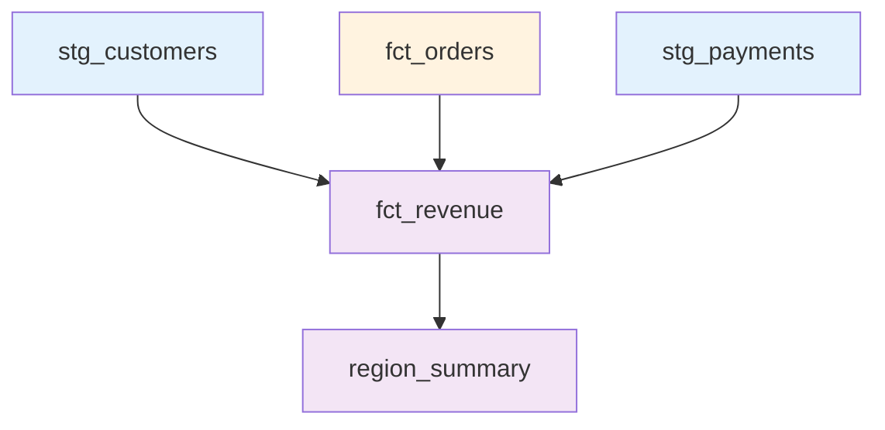

# Finance Marts

Reference documentation for finance-specific marts models.

## Overview

Finance marts provide revenue and financial aggregations for executive reporting and financial analysis.



## Model List

| Model | Type | Schema | Purpose |
|-------|------|--------|---------|
| [fct_revenue](#fct_revenue) | Fact | mart_finance | Daily revenue aggregates |
| [region_summary](#region_summary) | Summary | mart_finance | Regional rollup metrics |

---

## fct_revenue

Daily revenue aggregates by date, region, and currency for financial reporting.

### Model Details

**Path**: `models/marts/finance/fct_revenue.sql`

**Type**: Fact (Aggregated)

**Schema**: `mart_finance`

**Materialization**: Table

**Lineage**:
- Inputs: `stg_customers`, `fct_orders`, `stg_payments`
- Referenced by: `region_summary`, Executive dashboard

### Business Logic

1. **Net Revenue Calculation**
   ```sql
   SUM(o.order_total - COALESCE(p.refund_amount, 0)) as total_revenue
   ```

2. **Active Orders Only**
   ```sql
   WHERE o.is_deleted = FALSE
   ```

3. **Daily Aggregation**
   ```sql
   GROUP BY 
       o.order_date,
       c.region,
       o.currency
   ```

4. **Metric Calculation**
   ```sql
   COUNT(DISTINCT o.order_id) as order_count,
   AVG(o.order_total) as avg_order_value
   ```

### Columns

| Column | Type | Description | Calculation |
|--------|------|-------------|-------------|
| date | date | Revenue date | order_date |
| region | string | Geographic region | From dim_customers |
| currency | string | Currency code | From fct_orders |
| total_revenue | decimal(19,2) | Net revenue | SUM(order_total - refunds) |
| order_count | integer | Number of orders | COUNT(orders) |
| avg_order_value | decimal(19,2) | Average order | AVG(order_total) |

### Composite Key

```
PRIMARY KEY (date, region, currency)
```

This ensures one record per unique combination of date, region, and currency.

### Documentation

```markdown
{{ doc('total_revenue') }}
Total Revenue is the sum of all net order totals, excluding 
refunds and cancellations. Used for executive reporting and 
financial reconciliation.
```

### Configuration

```yaml
{{ config(
    materialized='table',
    schema='mart_finance'
) }}
```

### Tests

```yaml
models:
  - name: fct_revenue
    columns:
      - name: date
        tests:
          - not_null
      
      - name: region
        tests:
          - not_null
          - accepted_values:
              values: ['North America', 'EMEA', 'APAC', 'LATAM']
      
      - name: currency
        tests:
          - not_null
      
      - name: total_revenue
        tests:
          - not_null
          - dbt_expectations.expect_column_values_to_be_between:
              min_value: 0
      
      - name: order_count
        tests:
          - not_null
          - dbt_expectations.expect_column_values_to_be_between:
              min_value: 0
```

### Usage Examples

**Daily Revenue Trend**:
```sql
SELECT 
    date,
    total_revenue,
    order_count
FROM {{ ref('fct_revenue') }}
ORDER BY date
```

**Revenue by Region**:
```sql
SELECT 
    region,
    SUM(total_revenue) as total_revenue,
    SUM(order_count) as total_orders
FROM {{ ref('fct_revenue') }}
GROUP BY region
ORDER BY total_revenue DESC
```

**Monthly Revenue**:
```sql
SELECT 
    DATE_TRUNC('month', date) as month,
    SUM(total_revenue) as revenue,
    SUM(order_count) as orders
FROM {{ ref('fct_revenue') }}
GROUP BY 1
ORDER BY 1
```

**Revenue vs Target**:
```sql
WITH daily_revenue AS (
    SELECT 
        date,
        SUM(total_revenue) as actual_revenue
    FROM {{ ref('fct_revenue') }}
    GROUP BY date
)
SELECT 
    dr.*,
    t.daily_target,
    (dr.actual_revenue / t.daily_target - 1) * 100 as vs_target_pct
FROM daily_revenue dr
LEFT JOIN targets t ON dr.date = t.date
```

**Currency Breakdown**:
```sql
SELECT 
    currency,
    SUM(total_revenue) as total_revenue,
    AVG(avg_order_value) as avg_order
FROM {{ ref('fct_revenue') }}
GROUP BY currency
```

---

## region_summary

Dynamic region rollup with configurable aggregations.

### Model Details

**Path**: `models/marts/finance/region_summary.sql`

**Type**: Summary (Dynamic)

**Schema**: `mart_finance`

**Materialization**: Table

**Lineage**:
- Input: `fct_revenue`
- Used by: Executive dashboard, Regional reports

### Business Logic

Uses `generate_region_summary_sql()` macro to dynamically generate UNION ALL queries:

```sql
{{ generate_region_summary_sql(var('regions')) }}
```

### Configuration

**Default Regions** (in `dbt_project.yml`):
```yaml
vars:
  regions:
    - North America
    - EMEA
    - APAC
    - LATAM
```

### Generated SQL

For 4 regions, generates:

```sql
SELECT 
    'North America' as region,
    SUM(total_revenue) as total_revenue,
    SUM(order_count) as total_orders,
    COUNT(DISTINCT customer_id) as total_customers,
    AVG(avg_order_value) as avg_order_value
FROM {{ ref('fct_revenue') }}
WHERE region = 'North America'

UNION ALL

SELECT 
    'EMEA' as region,
    ...
WHERE region = 'EMEA'

UNION ALL

SELECT 
    'APAC' as region,
    ...
WHERE region = 'APAC'

UNION ALL

SELECT 
    'LATAM' as region,
    ...
WHERE region = 'LATAM'
```

### Columns

| Column | Type | Description | Calculation |
|--------|------|-------------|-------------|
| region | string | Region name | From variable |
| total_revenue | decimal(19,2) | Sum of revenue | SUM(fct_revenue.total_revenue) |
| total_orders | integer | Order count | SUM(fct_revenue.order_count) |
| total_customers | integer | Unique customers | COUNT(DISTINCT customer_id) |
| avg_order_value | decimal(19,2) | Average order | AVG(fct_revenue.avg_order_value) |

### Runtime Configuration

Override regions at runtime:

```bash
# Use only specific regions
dbt run --select region_summary --vars '{regions: ["North America", "EMEA"]}'

# Add new region
dbt run --select region_summary --vars '{regions: ["North America", "EMEA", "APAC", "LATAM", "Middle East"]}'
```

### Tests

```yaml
models:
  - name: region_summary
    columns:
      - name: region
        tests:
          - not_null
          - unique
      
      - name: total_revenue
        tests:
          - not_null
          - dbt_expectations.expect_column_values_to_be_between:
              min_value: 0
```

### Usage Examples

**Regional Performance Ranking**:
```sql
SELECT 
    region,
    total_revenue,
    total_orders,
    avg_order_value,
    RANK() OVER (ORDER BY total_revenue DESC) as revenue_rank
FROM {{ ref('region_summary') }}
ORDER BY total_revenue DESC
```

**Region Market Share**:
```sql
WITH totals AS (
    SELECT SUM(total_revenue) as global_revenue
    FROM {{ ref('region_summary') }}
)
SELECT 
    rs.region,
    rs.total_revenue,
    (rs.total_revenue / t.global_revenue) * 100 as market_share_pct
FROM {{ ref('region_summary') }} rs
CROSS JOIN totals t
ORDER BY market_share_pct DESC
```

**Regional Growth** (Compare to Previous Period):
```sql
WITH current_period AS (
    SELECT 
        region,
        SUM(total_revenue) as revenue
    FROM {{ ref('fct_revenue') }}
    WHERE date >= CURRENT_DATE - 30
    GROUP BY region
),
previous_period AS (
    SELECT 
        region,
        SUM(total_revenue) as revenue
    FROM {{ ref('fct_revenue') }}
    WHERE date >= CURRENT_DATE - 60
      AND date < CURRENT_DATE - 30
    GROUP BY region
)
SELECT 
    c.region,
    c.revenue as current_revenue,
    p.revenue as previous_revenue,
    ((c.revenue - p.revenue) / NULLIF(p.revenue, 0)) * 100 as growth_pct
FROM current_period c
LEFT JOIN previous_period p ON c.region = p.region
```

**Customer Concentration by Region**:
```sql
SELECT 
    region,
    total_customers,
    total_revenue,
    total_revenue / NULLIF(total_customers, 0) as revenue_per_customer
FROM {{ ref('region_summary') }}
ORDER BY revenue_per_customer DESC
```

---

## Finance Marts Patterns

### Pattern 1: Aggregated Fact

**`fct_revenue`** - Pre-aggregated by dimensions:
- Grain: Date + Region + Currency
- Pre-calculated metrics
- Optimized for reporting

### Pattern 2: Dynamic SQL

**`region_summary`** - Macro-generated queries:
- Configurable via variables
- DRY (Don't Repeat Yourself)
- Easy to add/remove regions

### Pattern 3: Cross-Mart Validation

**Revenue Consistency Test**:
```sql
-- Tests/revenue_consistency.sql
-- Validates fct_orders.net_order_total = fct_revenue.total_revenue
```

---

## Testing Summary

### Finance Marts Test Coverage

| Model | Tests | Dynamic | Cross-Mart Validation |
|-------|-------|---------|---------------------|
| fct_revenue | 8 | No | Yes (revenue_consistency) |
| region_summary | 4 | Yes | No |

### Revenue Consistency Test

Located at: `tests/revenue_consistency.sql`

**Purpose**: Ensure revenue totals match across marts

**Logic**:
```sql
SELECT 
    SUM(order_total) as orders_revenue
FROM {{ ref('fct_orders') }}
WHERE is_deleted = FALSE

UNION ALL

SELECT 
    SUM(total_revenue) as revenue_total
FROM {{ ref('fct_revenue') }}
```

**Expected**: Both values should match

**Failure Indicates**:
- Logic error in aggregation
- Missing records in one model
- Refund calculation mismatch

---

## Related Documentation

- [Data Dictionary](../../data-dictionary.md) - All columns
- [Testing Strategy](../../tests.md) - Testing details
- [Core Marts](../marts-core/index.md) - Customer and order models
- [Macro Reference](../../macros.md) - generate_region_summary_sql macro
- [Architecture Overview](../../../architecture/index.md) - Patterns
