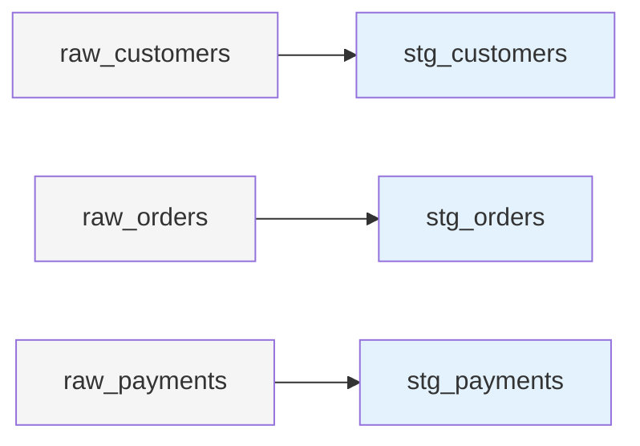

# Staging Models

Reference documentation for all staging layer models.

## Overview

Staging models standardize raw data from seeds into clean, consistent formats. They serve as the foundation for all downstream transformations.



## Model List

| Model | Source | Records | Transformations |
|-------|--------|---------|-----------------|
| [stg_customers](#stg_customers) | raw_customers | 11 | Cleaning, normalization |
| [stg_orders](#stg_orders) | raw_orders | 12 | Soft deletes, standardization |
| [stg_payments](#stg_payments) | raw_payments | 12 | Method normalization |

---

## stg_customers

Standardizes customer data with cleaning and normalization.

### Model Details

**Path**: `models/staging/stg_customers.sql`

**Schema**: `stg`

**Materialization**: View

**Source**: `raw_customers` seed

### Transformations

1. **Surrogate Key Generation**
   ```sql
   {{ dbt_utils.generate_surrogate_key(['customer_id', 'name']) }} as customer_key
   ```

2. **Region Normalization**
   ```sql
   CASE region
       WHEN 'NA' THEN 'North America'
       WHEN 'Europe' THEN 'EMEA'
       WHEN 'Asia' THEN 'APAC'
       ELSE region
   END as region
   ```

3. **Email Normalization**
   ```sql
   LOWER(TRIM(email)) as email
   ```

4. **Name Cleaning**
   ```sql
   TRIM(INITCAP(name)) as name
   ```

5. **Status Standardization**
   ```sql
   LOWER(TRIM(status)) as status
   ```

### Columns

| Column | Type | Description | Source Transformation |
|--------|------|-------------|---------------------|
| customer_id | string | Natural key from source | None |
| customer_key | string | Surrogate key | Hash of customer_id + name |
| name | string | Customer full name | Trim, title case |
| email | string | Email address | Lowercase, trim |
| region | string | Geographic region | Normalize abbreviations |
| status | string | Customer status | Lowercase, trim |

### Tests

```yaml
models:
  - name: stg_customers
    columns:
      - name: customer_id
        tests:
          - not_null
          - unique:
              severity: warn  # Known duplicate: C002
          - is_alphanumeric
      
      - name: customer_key
        tests:
          - not_null
          - unique
      
      - name: status
        tests:
          - accepted_values:
              values: ['active', 'inactive']
```

### Data Quality Issues (Intentional)

**Known Issues in Seed Data**:

| Issue | Customer ID | Description |
|-------|-------------|-------------|
| Duplicate ID | C002 | Appears twice in seed |
| Missing Name | C007 | Name field is empty |
| Mixed Case | Multiple | Emails have mixed casing |
| Region Variants | Multiple | "NA", "North America", etc. |

### Usage

```sql
-- Reference in downstream models
SELECT *
FROM {{ ref('stg_customers') }}
WHERE status = 'active'
```

---

## stg_orders

Standardizes order transactions with soft-delete handling.

### Model Details

**Path**: `models/staging/stg_orders.sql`

**Schema**: `stg`

**Materialization**: View

**Source**: `raw_orders` seed

### Transformations

1. **Surrogate Key Generation**
   ```sql
   {{ dbt_utils.generate_surrogate_key(['order_id']) }} as order_key
   ```

2. **Soft Delete Flag**
   ```sql
   CASE
       WHEN status ILIKE '%canceled%' THEN TRUE
       WHEN status ILIKE '%returned%' THEN TRUE
       ELSE FALSE
   END as is_deleted
   ```

3. **Status Normalization**
   ```sql
   LOWER(TRIM(status)) as status
   ```

4. **Timestamp Generation**
   ```sql
   COALESCE(updated_at, CURRENT_TIMESTAMP()) as updated_at
   ```

### Columns

| Column | Type | Description | Source Transformation |
|--------|------|-------------|---------------------|
| order_id | string | Natural key from source | None |
| order_key | string | Surrogate key | Hash of order_id |
| customer_id | string | Customer reference | None |
| order_date | date | Order placement date | None |
| order_total | decimal | Order amount | Cast to decimal |
| currency | string | Currency code | Uppercase |
| status | string | Order status | Lowercase, trim |
| is_deleted | boolean | Soft delete flag | Derived from status |
| updated_at | timestamp | Last update | Coalesce with current |

### Tests

```yaml
models:
  - name: stg_orders
    columns:
      - name: order_id
        tests:
          - not_null
          - unique:
              severity: warn  # Known duplicate: O1002
          - is_alphanumeric
      
      - name: customer_id
        tests:
          - not_null
          - relationships:
              to: ref('stg_customers')
              field: customer_id
      
      - name: status
        tests:
          - accepted_values:
              values: ['completed', 'placed', 'shipped', 'returned', 'canceled']
```

### Data Quality Issues (Intentional)

**Known Issues in Seed Data**:

| Issue | Order ID | Description |
|-------|----------|-------------|
| Duplicate ID | O1002 | Appears twice in seed |
| Missing Total | O1004 | order_total is null |
| Mixed Case | Multiple | Status values have mixed case |

### Incremental Support

The `updated_at` column enables incremental processing in downstream `fct_orders`:

```sql
-- Used in fct_orders for incremental filtering
WHERE updated_at > (SELECT MAX(updated_at) FROM {{ this }})
```

### Usage

```sql
-- Active orders only
SELECT *
FROM {{ ref('stg_orders') }}
WHERE is_deleted = FALSE

-- Orders with customer info
SELECT 
    o.*,
    c.name as customer_name,
    c.email as customer_email
FROM {{ ref('stg_orders') }} o
JOIN {{ ref('stg_customers') }} c 
    ON o.customer_id = c.customer_id
```

---

## stg_payments

Standardizes payment transactions with method normalization.

### Model Details

**Path**: `models/staging/stg_payments.sql`

**Schema**: `stg`

**Materialization**: View

**Source**: `raw_payments` seed

### Transformations

1. **Surrogate Key Generation**
   ```sql
   {{ dbt_utils.generate_surrogate_key(['payment_id']) }} as payment_key
   ```

2. **Payment Method Normalization**
   ```sql
   CASE LOWER(TRIM(payment_method))
       WHEN 'credit card' THEN 'credit_card'
       WHEN 'credit-card' THEN 'credit_card'
       WHEN 'card' THEN 'credit_card'
       WHEN 'bank transfer' THEN 'bank_transfer'
       WHEN 'bank-transfer' THEN 'bank_transfer'
       ELSE LOWER(TRIM(payment_method))
   END as payment_method
   ```

3. **Amount Casting**
   ```sql
   CAST(amount AS DECIMAL(19,2)) as amount
   ```

### Columns

| Column | Type | Description | Source Transformation |
|--------|------|-------------|---------------------|
| payment_id | string | Natural key from source | None |
| payment_key | string | Surrogate key | Hash of payment_id |
| order_id | string | Order reference | None |
| payment_method | string | Payment method | Normalize variants |
| amount | decimal | Payment amount | Cast to decimal |
| provider_transaction_id | string | External reference | None |

### Tests

```yaml
models:
  - name: stg_payments
    columns:
      - name: payment_id
        tests:
          - not_null
          - unique
          - is_alphanumeric
      
      - name: order_id
        tests:
          - not_null
          - relationships:
              to: ref('stg_orders')
              field: order_id
      
      - name: payment_method
        tests:
          - accepted_values:
              values: ['credit_card', 'coupon', 'bank_transfer', 'gift_card']
```

### Data Quality Issues (Intentional)

**Known Issues in Seed Data**:

| Issue | Payment ID | Description |
|-------|------------|-------------|
| Duplicate ID | P5002 | Appears twice in seed |
| Missing Amount | P5005 | Amount is null |
| Method Variants | Multiple | "Credit Card", "credit-card", "card" |

### Usage

```sql
-- Payment summary by order
SELECT 
    order_id,
    SUM(amount) as total_payments,
    COUNT(*) as payment_count
FROM {{ ref('stg_payments') }}
GROUP BY order_id

-- Payment method breakdown
SELECT 
    payment_method,
    COUNT(*) as transaction_count,
    SUM(amount) as total_amount
FROM {{ ref('stg_payments') }}
GROUP BY payment_method
```

---

## Testing Summary

### Staging Layer Test Coverage

| Model | Tests | Pass | Warn | Notes |
|-------|-------|------|------|-------|
| stg_customers | 9 | 7 | 2 | C002 duplicate |
| stg_orders | 10 | 8 | 2 | O1002 duplicate, null order_total |
| stg_payments | 8 | 7 | 1 | P5002 duplicate |

### Test Types

- **not_null**: All key fields (customer_id, order_id, payment_id, etc.)
- **unique**: Primary keys (some with warnings for known duplicates)
- **relationships**: Foreign keys (customer_id, order_id)
- **accepted_values**: Categorical fields (status, payment_method, region)
- **is_alphanumeric**: ID validation (custom test)

---

## Related Documentation

- [Data Dictionary](../../data-dictionary.md) - All column definitions
- [Testing Strategy](../../tests.md) - Testing approach
- [Intermediate Models](../intermediate/index.md) - Next layer
- [Architecture Overview](../../../architecture/index.md) - Layer explanation
