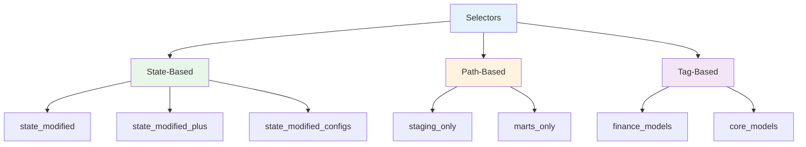
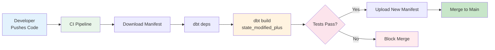

# Selectors Reference

Complete guide to using selectors for efficient model selection and CI/CD.

## Overview

Selectors allow you to define reusable selection criteria in `selectors.yml`, making it easy to:

- Run specific model groups
- Implement state-based CI/CD
- Simplify complex selections
- Share selection logic across the team



## Selector Configuration

All selectors are defined in `selectors.yml`:

```yaml
selectors:
  - name: state_modified
    definition:
      method: state
      value: modified

  - name: state_modified_plus
    definition:
      method: state
      value: modified+

  - name: staging_only
    definition:
      method: path
      value: models/staging

  - name: marts_only
    definition:
      method: path
      value: models/marts
```

## Pre-Defined Selectors

### State-Based Selectors

These selectors compare the current state against a previous manifest.

#### `state_modified`

Selects only models that have been modified since the last manifest.

**Usage**:
```bash
dbt build --select state_modified --state path/to/previous/manifest
```

**Use Case**: Run only changed models in CI

**Definition**:
```yaml
- name: state_modified
  definition:
    method: state
    value: modified
```

---

#### `state_modified_plus`

Selects modified models AND all their downstream dependencies.

**Usage**:
```bash
dbt build --select state_modified_plus --state path/to/previous/manifest
```

**Use Case**: CI/CD - ensure changes don't break downstream

**Definition**:
```yaml
- name: state_modified_plus
  definition:
    method: state
    value: modified+
```

**Example**:

```
Changes: stg_orders
    ↓
Affected: stg_orders
          int_order_payments
          fct_orders
          fct_revenue
          region_summary
```

---

#### `state_modified_configs`

Selects models with configuration changes only (not SQL changes).

**Usage**:
```bash
dbt build --select state_modified_configs --state path/to/previous/manifest
```

**Use Case**: Deploy config changes without rebuilding data

**Definition**:
```yaml
- name: state_modified_configs
  definition:
    method: state
    value: modified.configs
```

---

### Path-Based Selectors

These selectors select models based on their file path.

#### `staging_only`

Selects all models in the `models/staging/` directory.

**Usage**:
```bash
dbt run --select staging_only
```

**Models Selected**:
- `stg_customers`
- `stg_orders`
- `stg_payments`

**Definition**:
```yaml
- name: staging_only
  definition:
    method: path
    value: models/staging
```

---

#### `marts_only`

Selects all models in the `models/marts/` directory.

**Usage**:
```bash
dbt run --select marts_only
```

**Models Selected**:
- `dim_customers`
- `fct_orders`
- `fct_customer_ltv`
- `fct_revenue`
- `region_summary`

**Definition**:
```yaml
- name: marts_only
  definition:
    method: path
    value: models/marts
```

---

### Layer Selectors

#### `intermediate_only`

Selects intermediate layer models.

**Usage**:
```bash
dbt run --select path:models/intermediate
```

**Models**:
- `int_order_payments`
- `int_order_status_categorized`

---

### Tag-Based Selectors

While not pre-defined, you can use tags for selection:

**Adding Tags**:
```yaml
# schema.yml
models:
  - name: fct_revenue
    config:
      tags: ['finance', 'daily']
```

**Selecting by Tag**:
```bash
dbt run --select tag:finance
dbt run --select tag:daily
```

---

## State-Based CI/CD Workflow

### Setup

1. **Save Manifest After Production Build**:
```bash
# After successful production build
dbt build
cp target/manifest.json manifests/production/manifest.json
```

2. **Configure CI to Use Manifest**:
```yaml
# GitHub Actions example
- name: Download Production Manifest
  run: |
    aws s3 cp s3://bucket/manifest.json manifests/production/

- name: Build Modified Models
  run: |
    dbt build \
      --select state_modified_plus \
      --state manifests/production \
      --defer
```

### CI/CD Pipeline



### Benefits

| Benefit | Description |
|---------|-------------|
| **Speed** | Only build what's changed |
| **Cost** | Reduced compute in warehouse |
| **Safety** | Downstream models tested |
| **Efficiency** | Defer to production for unchanged models |

---

## Advanced Selection Patterns

### Combining Selectors

```bash
# Run staging AND marts
dbt run --select staging_only marts_only

# Run staging OR intermediate
dbt run --select staging_only,intermediate_only

# Exclude specific models
dbt run --select marts_only --exclude fct_orders
```

### Selection Operators

| Operator | Description | Example |
|----------|-------------|---------|
| `+` | Upstream/Downstream | `+model` (parents), `model+` (children) |
| `@` | At operator | `@model` (parents + children) |
| `,` | Union | `model1,model2` (either) |
| ` ` | Intersection | `tag:nightly path:models/marts` (both) |
| `--exclude` | Exclude | `--exclude model_name` |

### Examples

**Run model + all downstream**:
```bash
dbt run --select stg_orders+
```

**Run all parents of a model**:
```bash
dbt run --select +fct_orders
```

**Run intersection**:
```bash
# Only marts models with 'finance' tag
dbt run --select marts_only tag:finance
```

**Run union**:
```bash
# Either staging or core marts
dbt run --select staging_only,path:models/marts/core
```

---

## Creating Custom Selectors

### Basic Selector

```yaml
# selectors.yml
selectors:
  - name: finance_models
    description: "All finance-related models"
    definition:
      method: tag
      value: finance
```

### Complex Selector

```yaml
# selectors.yml
selectors:
  - name: critical_models
    description: "Models required for executive dashboard"
    definition:
      union:
        - method: fqn
          value: dim_customers
        - method: fqn
          value: fct_orders
        - method: fqn
          value: fct_revenue
        - method: path
          value: models/marts/core
```

### Selector with Exclusions

```yaml
# selectors.yml
selectors:
  - name: non_finance_marts
    description: "Marts excluding finance models"
    definition:
      intersection:
        - method: path
          value: models/marts
        - exclude:
            - method: path
              value: models/marts/finance
```

---

## Selector Methods

| Method | Description | Example |
|--------|-------------|---------|
| `fqn` | Fully qualified name | `model.project.model_name` |
| `path` | File path | `models/staging` |
| `tag` | Model tags | `tag:finance` |
| `package` | Package name | `package:dbt_utils` |
| `config` | Config value | `config:materialized:table` |
| `test_name` | Test name | `test_name:unique` |
| `test_type` | Test type | `test_type:generic` |
| `state` | State comparison | `state:modified` |
| `exposure` | Exposure name | `exposure:finance_dashboard` |
| `metric` | Metric name | `metric:total_revenue` |
| `source` | Source name | `source:raw_orders` |

---

## State Comparison Options

| Value | Description |
|-------|-------------|
| `modified` | SQL or config changed |
| `modified.body` | SQL changed only |
| `modified.configs` | Config changed only |
| `modified.relation` | Database relation changed |
| `modified.persisted_descriptions` | Descriptions changed |
| `new` | New models |
| `unmodified` | Unchanged models |

---

## Best Practices

### Do

✅ **Use selectors for CI/CD**
- Faster builds
- Lower costs
- Safer deployments

✅ **Name selectors clearly**
- `state_modified_plus` vs `smp`
- Include description

✅ **Save manifests**
- Store in S3, GCS, or artifacts
- Version control for important states

✅ **Test selectors**
- Run `dbt ls --select selector_name` to verify
- Document expected models

✅ **Combine with --defer**
- Don't rebuild unchanged upstream models
- Reference production for unmodified models

### Don't

❌ **Forget to save manifest**
State selectors require a manifest to compare against.

❌ **Use state selectors without --state**
Always provide `--state path/to/manifest`.

❌ **Create too many selectors**
Keep it simple. 5-10 selectors is usually enough.

❌ **Ignore downstream models**
Use `state_modified_plus` not `state_modified` in CI.

---

## Troubleshooting

### "No nodes selected"

**Cause**: Selector criteria doesn't match any models

**Solution**:
```bash
# Test selector
dbt ls --select my_selector

# Check selector definition
```

### "Manifest not found"

**Cause**: `--state` path is incorrect

**Solution**:
```bash
# Verify manifest exists
ls -la path/to/manifest.json

# Use correct path
dbt build --select state_modified --state path/to/manifest
```

### "State comparison failed"

**Cause**: Manifest is incompatible (different dbt version, etc.)

**Solution**:
- Regenerate manifest with same dbt version
- Check manifest is from same project

---

## Example CI/CD Configuration

### GitHub Actions

```yaml
name: dbt CI

on:
  pull_request:
    branches: [ main ]

jobs:
  test:
    runs-on: ubuntu-latest
    steps:
      - uses: actions/checkout@v3
      
      - name: Download Production Manifest
        run: |
          aws s3 cp s3://my-bucket/manifest.json ./manifest.json
      
      - name: Install dbt
        run: pip install -r requirements.txt
      
      - name: Install Dependencies
        run: dbt deps
      
      - name: Build Modified Models
        run: |
          dbt build \
            --select state_modified_plus \
            --state ./manifest.json \
            --defer \
            --target ci
      
      - name: Run Tests
        run: dbt test --select state_modified_plus --state ./manifest.json
```

---

## Related Documentation

- [dbt Selection Syntax](https://docs.getdbt.com/reference/node-selection/syntax)
- [State Comparison](https://docs.getdbt.com/reference/node-selection/methods#state)
- [Selectors YML](https://docs.getdbt.com/reference/node-selection/yaml-selectors)
- [Defer](https://docs.getdbt.com/reference/node-selection/defer)
