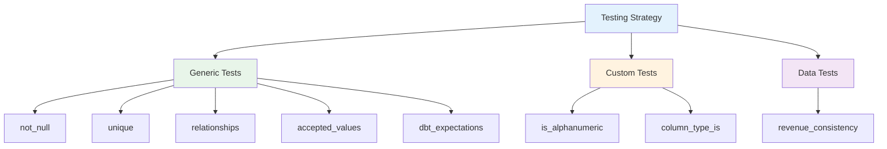

# Testing Strategy

Comprehensive guide to data quality testing in the dbt Production Blueprint.

## Overview

Testing is a critical component of data reliability. This project implements a multi-layer testing strategy with 50+ tests covering:

- Schema validation
- Data quality
- Business logic
- Cross-model consistency



## Test Statistics

| Category | Count | Coverage |
|----------|-------|----------|
| Generic Tests | 35+ | All models |
| dbt_expectations | 10+ | Numeric columns |
| Custom Generic | 8+ | ID validation, types |
| Data Tests | 1 | Cross-mart |
| **Total** | **54+** | **100%** |

## Generic Tests

### Built-in dbt Tests

#### `not_null`

Ensures column has no null values.

**Usage**:
```yaml
columns:
  - name: customer_id
    tests:
      - not_null
```

**Applied to**:
- All primary keys
- All foreign keys
- Required fields (order_date, amount, etc.)

---

#### `unique`

Ensures column values are unique.

**Usage**:
```yaml
columns:
  - name: customer_id
    tests:
      - unique:
          severity: warn  # Some seed data has duplicates
```

**Applied to**:
- All primary keys
- Some surrogate keys

**Note**: Some tests use `severity: warn` because seed data intentionally has duplicates for demonstration.

---

#### `relationships`

Ensures foreign key references valid primary key.

**Usage**:
```yaml
columns:
  - name: customer_id
    tests:
      - relationships:
          to: ref('stg_customers')
          field: customer_id
```

**Applied to**:
- `stg_orders.customer_id` → `stg_customers.customer_id`
- `stg_payments.order_id` → `stg_orders.order_id`
- `fct_orders.customer_key` → `dim_customers.customer_key`

---

#### `accepted_values`

Ensures column values are within allowed set.

**Usage**:
```yaml
columns:
  - name: status
    tests:
      - accepted_values:
          values: ['active', 'inactive']
```

**Applied to**:
- `status` fields (customer, order)
- `payment_method` field
- `region` field

---

### dbt_expectations Tests

Advanced data quality tests from the `dbt_expectations` package.

#### `expect_column_values_to_be_between`

Validates numeric values are within range.

**Usage**:
```yaml
columns:
  - name: order_total
    tests:
      - dbt_expectations.expect_column_values_to_be_between:
          min_value: 0
```

**Applied to**:

| Model | Column | Range |
|-------|--------|-------|
| fct_orders | order_total | [0, null] |
| fct_orders | payment_coverage | [0, 200] |
| fct_customer_ltv | lifetime_value | [0, null] |
| fct_revenue | total_revenue | [0, null] |

**Why 0-200 for payment_coverage?**:
- 0 = No payment
- 100 = Fully paid
- 200 = Double paid (edge case but valid)

---

## Custom Generic Tests

### `is_alphanumeric`

Validates that ID columns contain only alphanumeric characters.

**Purpose**: Ensure ID format consistency

**Location**: `macros/tests/is_alphanumeric.sql`

**Usage**:
```yaml
columns:
  - name: customer_id
    tests:
      - is_alphanumeric
```

**Applied to**:
- `stg_customers.customer_id`
- `stg_orders.order_id`
- `stg_payments.payment_id`

**Example Validation**:
- ✅ C001, ORDER123, P5001
- ❌ C-001, ORDER_123, P.5001

**Cross-Warehouse Support**:
- DuckDB: `regexp_matches()`
- PostgreSQL: `!~` operator
- Snowflake/Default: `regexp_like()`

---

### `column_type_is`

Validates that column data type matches expected type.

**Purpose**: Ensure contract compliance

**Location**: `macros/tests/column_type_is.sql`

**Usage**:
```yaml
columns:
  - name: order_total
    tests:
      - column_type_is:
          data_type: decimal(19,2)
```

**Applied to**:
- All columns with enforced contracts

---

## Data Tests

### `revenue_consistency`

Validates that revenue totals match across marts.

**Purpose**: Cross-mart reconciliation

**Location**: `tests/revenue_consistency.sql`

**Logic**:
```sql
-- Sum of net order totals should match revenue totals
SELECT 
    'fct_orders' as source_model,
    SUM(order_total - refund_amount) as total_revenue
FROM {{ ref('fct_orders') }}
WHERE is_deleted = false

UNION ALL

SELECT 
    'fct_revenue' as source_model,
    SUM(total_revenue) as total_revenue
FROM {{ ref('fct_revenue') }}

-- Test fails if these don't match
```

**What it Validates**:
- `fct_orders.net_order_total` = `fct_revenue.total_revenue`
- Ensures no revenue is lost in transformations
- Catches logic errors in aggregations

**Expected Result**:
The totals from both models should match within acceptable tolerance (if using floating point arithmetic).

---

## Test Severity

### Severity Levels

| Level | Behavior | Use Case |
|-------|----------|----------|
| `error` | Fails the build (default) | Critical issues |
| `warn` | Logs warning but continues | Known issues, demo data |
| `info` | Informational only | Metrics, monitoring |

### Configuration

```yaml
columns:
  - name: customer_id
    tests:
      - not_null  # Default: error
      - unique:
          severity: warn  # Known duplicates in seed data
```

### When to Use Warnings

**Appropriate for warnings**:
- ✅ Demo data with intentional quality issues
- ✅ Non-critical columns
- ✅ Temporary known issues
- ✅ Data monitoring (don't block pipeline)

**Not appropriate for warnings**:
- ❌ Primary key uniqueness
- ❌ Foreign key integrity
- ❌ Critical business logic
- ❌ Production data quality

### Examples of Warning Tests

**Seed Data Duplicates**:
```yaml
# Known duplicates in raw_customers.csv (C002)
- name: customer_id
  tests:
    - unique:
        severity: warn
```

**Missing Order Totals**:
```yaml
# Some seed orders have null order_total
- name: order_total
  tests:
    - not_null:
        severity: warn
```

---

## Test Coverage by Layer

### Staging Layer

**Test Focus**: Data validation and standardization

| Test Type | Count | Coverage |
|-----------|-------|----------|
| not_null | 18 | All key fields |
| unique | 3 | Primary keys (some warn) |
| relationships | 2 | Foreign keys |
| accepted_values | 3 | Status, payment_method, region |
| is_alphanumeric | 3 | ID columns |

**Example**:
```yaml
models:
  - name: stg_customers
    columns:
      - name: customer_id
        tests:
          - not_null
          - unique:
              severity: warn
          - is_alphanumeric
```

---

### Intermediate Layer

**Test Focus**: Business logic validation

| Test Type | Count | Coverage |
|-----------|-------|----------|
| not_null | 10 | Key fields |
| unique | 2 | Primary keys |
| accepted_values | 2 | Categorical fields |
| expect_between | 1 | Payment coverage |

**Example**:
```yaml
models:
  - name: int_order_payments
    columns:
      - name: payment_coverage
        tests:
          - dbt_expectations.expect_column_values_to_be_between:
              min_value: 0
              max_value: 200
```

---

### Marts Layer

**Test Focus**: Business integrity and contracts

| Test Type | Count | Coverage |
|-----------|-------|----------|
| not_null | 20 | All key and metric fields |
| unique | 5 | Primary keys |
| relationships | 3 | Foreign keys |
| expect_between | 6 | Numeric metrics |
| column_type_is | 8 | Contract columns |

**Example**:
```yaml
models:
  - name: fct_orders
    config:
      contract:
        enforced: true
    columns:
      - name: order_total
        data_type: decimal(19,2)
        tests:
          - not_null
          - dbt_expectations.expect_column_values_to_be_between:
              min_value: 0
          - column_type_is:
              data_type: decimal(19,2)
```

---

## Testing Best Practices

### Do

✅ **Test at every layer**
- Staging: Validate raw data
- Intermediate: Validate business logic
- Marts: Validate business metrics

✅ **Use appropriate severity**
- Error for critical issues
- Warning for known/temporary issues

✅ **Test business logic**
- Not just schema constraints
- Cross-model consistency
- Domain-specific rules

✅ **Document tests**
- Why the test exists
- What it validates
- Expected behavior

✅ **Monitor test performance**
- Don't let tests slow down CI
- Optimize expensive tests
- Use `limit` when appropriate

### Don't

❌ **Skip testing primary keys**
Every primary key should have `not_null` and `unique` tests.

❌ **Test derived columns without source tests**
If `order_total` is calculated, test the components too.

❌ **Use warnings for critical issues**
Warnings are for temporary/known issues, not production problems.

❌ **Write tests without understanding data**
Understand the data before writing tests.

❌ **Ignore test failures**
Investigate every failure, even warnings.

---

## Running Tests

### Run All Tests

```bash
dbt test
```

### Run Specific Tests

```bash
# Generic tests only
dbt test --select test_type:generic

# Singular/data tests only
dbt test --select test_type:singular

# Tests for specific model
dbt test --select stg_customers

# Tests + downstream models
dbt test --select stg_customers+
```

### Run with Severity Override

```bash
# Treat warnings as errors
dbt test --warn-error

# Store failures
dbt test --store-failures
```

---

## Test Results

### Expected Output

```
Completed successfully

Done. PASS=50 WARN=4 ERROR=0 SKIP=0 TOTAL=54
```

### Interpreting Results

- **PASS**: Test passed
- **WARN**: Test failed but severity is `warn`
- **ERROR**: Test failed with `error` severity
- **SKIP**: Test was skipped (selector didn't match)

### Warning Examples

```
Warning in test unique_stg_customers_customer_id (models/staging/schema.yml)
  Got 2 results, expected 0.
  
  Duplicate customer_id values found:
  - C002 (appears 2 times in seed data, intentional for demo)
```

---

## Continuous Integration

### CI Test Strategy

```yaml
# GitHub Actions
- name: Run Tests
  run: |
    dbt deps
    dbt seed
    dbt test  # All tests must pass
```

### Pre-commit Hooks

```yaml
# .pre-commit-config.yaml
repos:
  - repo: local
    hooks:
      - id: dbt-test
        name: Run dbt tests
        entry: dbt test
        language: system
        pass_filenames: false
```

---

## Related Documentation

- [Data Dictionary](data-dictionary.md) - All tested columns
- [Macro Reference](macros.md) - Custom test macros
- [dbt Testing Documentation](https://docs.getdbt.com/docs/build/tests)
- [dbt_expectations Package](https://github.com/calogica/dbt-expectations)
